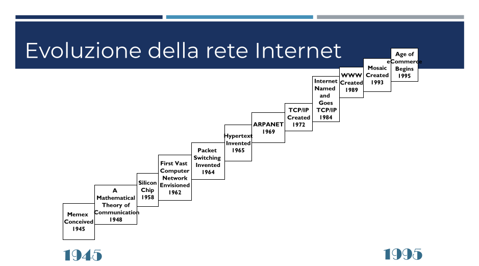
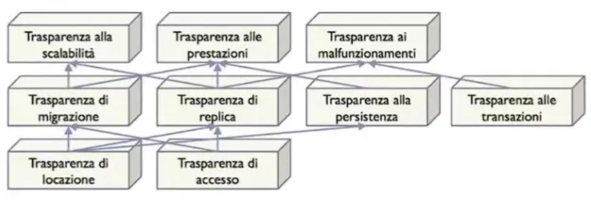

[Lezione1.pdf](../slides/1_PrologoSDeKeywork.pdf)

## Sistema Distribuito

È un insieme di macchine, gestite in maniera autonoma ed indipendente connesse attraverso una rete. Ogni nodo coordina il proprio lavoro attraverso uno strato di software, detto middleware. Il middleware permette all’utente (programmatore) di percepire il sistema come un’unica entità.

## Approccio Metodologico all’Innovazione (Motivazioni tecnologiche)

Il rapido sviluppo delle tecnologie hardware mette a dura prova le tecniche di progettazione e realizzazione dei software e sistemi. Bisogna considerare anche l’evoluzione di un sistema per poter gestire il processo tecnologico. Deve poter assecondare l’evoluzione tecnologica inserendola nel sistema. 

Come appreso dalle varie leggi:

**Moore**: il numero di transistor per chip raddoppia ogni 2 anni

**Sarnoff**: il valore o utilià di una rete è direttamente proporzionale al numero di utenti $V = a \cdot N$ 

**Metcalfe**: il valore di una rete è direttamente proporzionale al quadrato del numero degli utenti $V = a \cdot N + b \cdot N²$

**Reed**: il valore di una rete è direttamente proporzionale ad una funzione esponenziale in $N$, $V = a \cdot N + b \cdot N² + c \cdot 2^N$

## Esigenze Economiche {libro}

I sistemi distribuiti rispondono al problema delle frequenti acquisizioni, integrazioni e fusioni di aziende. Affrontano in tempi brevi le integrazioni dei sistemi per essere velocemente operativi. Analogamente, riescono a scalare bene anche in casi di “downsizing” di aziende. 
Questi sistemi sono assemblati utilizzando componenti preesistenti che però hanno requisiti hardware e software che rendono necessario separarli in diversi ambienti ed host per utilizzarli attraverso la realizzazione di un sistema distribuito. 
Ogni servizio su Internet inoltre può essere potenzialmente accessibile ad una platea smisurata di utenti e quindi il nostro sistema può avere picchi di carico non previsti. A differenza di sistemi centralizzati o client-server i sistemi distribuiti sono capaci di poter reggere meglio.

Spesso incontrano notevoli difficoltà di progettazione, sviluppo, gestione ed evoluzione per via dell’inesorabile sviluppo della tecnologia hardware. E, associato al notevole costo per produrre software di qualità e complesso, far evolvere un sistema distribuito per migliorare l’esperienza utente e della tecnologia è compito assai arduo.

---

# **Open Distributed Processing**

[Lezione2.pdf](/slides/2_OpenDistributedProcessingMiddleware.pdf)

È un modello comune **di riferimento** per produttori, sviluppatori e progettisti in maniera da essere indipendente dalla specifica implementazione tecnologica. Ha come obiettivo quello di favorire la diffusione dei benefici della distribuzione di servizi di elaborazione di informazione in un ambiente di risorse e nodi eterogenei in multipli domini amministrativi di gestione. 

Il modello RM-ODP (Reference Model - Open Distributed Process) si basa sul modello ISO/OSI, con certi limiti nello strato superiore, in quanto i primi 6 forniscono il modello delle funzionalità proprie della comunicazione e tutti gli aspetti relativi alla distribuzione delle applicazioni all’interno del sistema distribuito ma il settimo racchiude funzionalità differenti

### Le Caratteristiche
- **Remoto**: componenti localizzate su macchine diverse ed accessibili esternamente
- **Concorrenza**: contemporanea esecuzione, su macchine diverse di varie istruzioni. Non si usano lock e semafori ma si sfrutta il multicore.
- **Assenza di Stato Globale**: la distanza e l’eterogeneità del sistema non permette di definire con certezza lo stato in cui si trova ciascun nodo.
- **Malfunzionamenti Parziali**: ogni componente può smettere di funzionare in maniera indipendente dalle altre, senza inficiare il resto del sistema
- **Eterogeneità**: l’hardware e software utilizzati nel sistema distribuito sono per definizione eterogenei. Dai sistemi operativi ai protocolli di rete, linguaggi, applicazioni e hardware.
- **Autonomia**: Non vi è un punto dove controllare tutto. La collaborazione è garantita da politiche di condivisione e accesso formalmente specificate.
- **Evoluzione**: I sistemi distribuiti assecondano l’evoluzione dell’ambiente all’interno del quale vengono realizzati e forniscono le loro funzionalità. La flessibilità deve essere tale da assecondare l’evoluzione senza costi eccessivi (continuare a supportare tecnologie Legacy).
- **Mobilità**: Così come gli utenti, il sistema deve essere mobile per adattare al meglio le prestazioni del sistema.

La realizzazione di un sistema distribuito non è agevole, vanno considerati altri aspetti generali e globali della architettura, standardizzati in maniera tale che possano servire da specifica per i fornitori di piattaforme hardware e software per fornire strumenti adeguati per agevolare progettazione, implementazione e manutenzione. Hanno un impatto significativo, specificando che la progettazione deve puntare alla realizzazione di sistemi distribuiti:

### Ricapitolando 
- **aperti**: per supportare la portabilità di esecuzione e di interoperabilità attraverso interfacce per far evolvere il sistema ma anche per evitare di rimanere legati ad un singolo fornitore.
- **integrati**: per incorporare al proprio interno sistemi e risorse differenti senza utilizzare strumenti ad-hoc. (per questo l’eterogeneità hardware e software).
- **flessibili**: per evolvere in maniera da integrare i sistemi *legacy* all’interno.
- **modulari**: permettere ad ogni componente di poter essere autonoma con un grado di indipendenza verso il resto del sistema.
- siano **federabili**: in modo da unire diversi sistemi dal punto di vista amministrativo oltre che architetturale.
- facilmente **gestibili**: per permettere il controllo, gestione e manutenzione per configurarne i servizi e politiche di accesso.
- con **alta qualità di servizio**: per poter fornire i servizi con vincoli di tempo, disponibilità ed affidabilità .
- **scalabili**: perché qualsiasi sistema distribuito accessibile da internet può essere soggetto a grandi picchi di carico.
- **sicuri**: gli utenti non autorizzati non devono accedere a dati sensibili.
- **trasparenti**: mascherando i dettagli e le differenze della architettura sottostante che assicura la distribuzione dei servizi sulle componenti del sistema. Agevolando progettazione ed implementazione.

## Trasparenza di un Sistema Distribuito

Viene definita durante la fase di progettazione ed è richiesta sia per l’intero sistema sia in maniera selettiva su alcune componenti, interfacce o servizi, definendo quali operazioni devono essere eseguite come transazioni, quali oggetti replicare sul sistema, la scalabilità ed altro. Alcuni tipi di trasparenza sono considerati talmente importanti da dover essere sempre presenti come quella di Locazione ed Accesso.

- **Di accesso**: nasconde le differenze nella rappresentazione dei dati e nell’invocazione per l’interoperabilità tra oggetti
- **Di locazione**: non è permesso usare informazioni sulla posizione di una componente del sistema, componente usata in maniera indipendente dalla locazione
- **Di migrazione**: il sistema può far migrare oggetti da un nodo del sistema all’altro senza che i fruitori dei servizi ne siano a conoscenza.
- **Di replica**: usato per le prestazioni, le repliche sono posizionate su altri nodi del sistema. Si basa su trasparenza di accesso e locazione.
- **Di persistenza**: l’oggetto è reso persistente senza che l’utente se ne debba occupare. Questo verrà poi re-attivato anche da nodi diversi da quello dove è stato deattivato
- **Di transazioni**: il sistema è implicitamente concorrente. Le transazioni sono garantite dal sistema. Si assicura che in caso di malfunzionamento una risorsa non si trovi in uno stato non coerente.
- **Di scalabilità**: basato su migrazioni e replica, il sistema è scalabile per servire carichi di lavoro crescenti senza modificare architettura ed organizzazione.
- **Di prestazioni**: i progettisti ottengono alte prestazioni senza conoscerne i meccanismi utilizzati.
- **Di malfunzionamenti**: la presenza di malfunzionamenti inificia parzialmente o meno il resto del sistema.