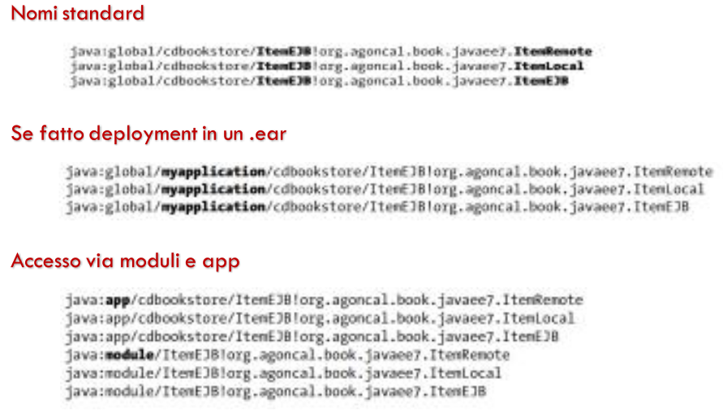

[Lezion10.pdf](/slides/10_2_EJB_1_NEW.pdf)
# Enterprise Java Beans

## Il ruolo degli EJB
- Il layer di persistenza rende facilmente gestibile la memorizzazione, ma non è adatto per il business Processing
- User Interfaces, allo stesso modo, non sono adatte per eseguire logica di business.
- La logica di business ha bisogno di un layer dedicato per le caratteristiche proprie.
<br><br>
- JPA (Data Layer) ha modellato i 'sostantivi' della nostra architettura, mentre EJB (Business Layer) modella 'i verbi'
- Il Business Layer ha il compito di:
  - gestire transazioni in sicurezza;
  - gestire comunicazione con componenti esterne ed interne all'architettura
    - interagire coi servizi esterni (SOAP e RESTful web services)
    - inviare messaggi asincroni (con JMS)
    - orchestrare componenti del DB verso sistemi esterni
    - servire il layer di presentazione
  - Tipi di EJB:
    - Stateless
    - Stateful
    - Singleton

## Servizi Forniti dai Container
- Comunicazione remota: client EJB possono invocare metodi remoti per mezzo di protocolli standard
- Iniezione di dipendenze JMS destination e factories, datasources, altri EJB, come pure altri POJO
- Gestione dello stato (per gli stateful)
- Pooling (efficienza, per gli stateless): creazione di un pool di istanze che possono essere condivise tra client multipli
- Ciclo di vita
- Gestione dei messaggi JMS
- Transazioni
- Sicurezza
- Concorrenza
- Interceptor e metodi
- Invocazione asincrona (senza messaggi)

### Interazione con il Container
- Fatto il deployment, il container offre i servizi, il programmatore si concentra sulla logica di business
- Gli EJB sono oggetti managed
- Quando un client invoca un metodo di un EJB, in effetti, invoca un proxy su di esso, frapposto dal container (che lo usa per fornire i servizi)
  - chiamata intercettata dal container, in maniera totalmente trasparente al client
- Specifiche EJB Lite permettono di implementare solo una parte delle specifiche
  - per permetter implementazioni non impegnative per i container provider.

# Tipi di EJBs
- Stateless
  - il session bean non contiene conversational state tra i metodi ed ogni istanza può essere usata da ogni client
- Stateful
  - il session bean contiene un conversational state che deve essere mantenuto attraverso i metodi per ogni singolo utente
- Singleton
  - un session bean è condiviso tra vari client e supporta accessi concorrenti
  - un container deve assicurare che esista una sola istanza per l'intera applicazione

```Java
// un EJB Stateless
@Stateless
public class BoojEJB {
    @PersistenceContext(unitName = "chapter07PU")
    private EntityManager em;
    
    public Book findBookById(Long id){
        return em.find(Book.class, id)
    }
    
    public Book createBook(Book book){
        em.persist(book);
        return book;
    }
}
```

### Anatomia di un EJB
- Un EJB si compone dei seguenti elementi:
  - **una classe**: annotata con @Stateless, @Stateful o @Singleton
  - **interfaccia di business**: locale, remota o nessuna (accesso locale - invocando la classe bean stessa, client ed EJB nello stesso package)

## Caratteristiche della classe Bean
- Una classe session Bean è una classe Java standard che implementa la logica di business:
  - I requirements per implementare un session bean sono i seguenti:
    - annotata con @Stateless, @Stateful o @Singleton o equivalente descriptor nell'XML
  - Implementare i metodi delle interfacce (se esistono)
  - Essere Public e non Final o Abstract
  - Costruttore pubblico senza parametri
  - Nessun metodo finalize()
  - I metodi non possono iniziare per ejb e non possono essere final o static
  - Argomenti e valori di ritorno devono essere tipi legali per RMI

## Remote, Local e No-Interface Views
- A seconda di __dove un client invoca un session bean__ il bean deve implementare un'interfaccia remota locale o una no-interface view
- Se l'architettura ha client che risiedono all'**esterno** dell'EJB container's JVM Instance, deve usare l'interfaccia remota.
- Si verifica per client in esecuzione:
  - su una JVM separata (o rich client)
  - in un application client container (ACC)
  - in un external web o EJB container
- In questo caso i client invocheranno i metodi del bean attraverso Remote Method Invocation (RMI)
<br><br>
- Si possono usare invocazioni locali quando i bean sono in esecuzione nella stessa JVM
  - Un EJB che invoca un altro EJB o una web component (Servlet, JSF) in esecuzione in un web container nella stessa JVM
- È possibile usare sia chiamate locali che remote sullo stesso session bean
<br><br>
- Un session bean può implementare diverse interfacce o nessuna
- Le annotazioni:
  - @Remote: denota una remote business interface
    - **Method parameters passati per valori e serializzati** essendo parte del protocollo RMI
  - @Local: denota una classe local business interface
  - **Method parameters passati per riferimento** dal client al bean
<br><br>
- No-Interface view
  - La vista senza interfaccia è una variante della vista locale (Local Interface) che espone tutti i metodi pubblici di business della classe bean localmente, senza l'utilizzo di un'interfaccia separata

## Esempio di utilizzo

```Java
@Local
public interface ItemLocal {
    List<Book> findBooks();
    List<CD> findCDs();
    //...
}
```

```Java
@Remote
public interface ItemRemote {
  List<Book> findBooks();
  List<CD> findCDs();
  Book createBook(Book book);
  CD createCD(CD cd);
  //...
}
```

```Java
// Utilizzo delle interfacce precedentemente annotate
@Stateless
public class ItemEJB implements ItemLocal, ItemRemote {
    //...
}
```

## Metodo alternativo per interfacce Legacy

```java
public interface ItemLocal {
    List<Book> findBooks();
    List<CD> findCDs();
    //...
}
```
```java
public interface ItemRemote {
  List<Book> findBooks();
  List<CD> findCDs();
  Book createBook(Book book);
  CD createCD(CD cd);
  //...
}
```

```java
@Stateless
@Remote(ItemRemote.class)
@Local(ItemLocal.class)
@LocalBean // ha una no-view interface
public static ItemEJB implements ItemLocal, ItemRemote {
    //...
}
```

## EJB e JNDI
- Alla creazione di un EJB viene creato un nome Java Naming and Directory Interface (JNDI)
- **java:<scope>[/<app-name>]/<module-name>/<bean-name>[!<FQ-interface-name>]**
  - **scope**:
    - global: permette l'esecuzione fuori l'applicazione Java EE per un accesso al namespace globale
      - accesso a bean remoti attraverso JNDI lookups
    - app: permette l'esecuzione della componente l'applicazione Java EE per un accesso al namespace dell'applicazione
      - all'interno della stessa applicazione
    - module: permette ad una componente l'esecuzione in l'accesso a namespace con moduli specifici
      - all'interno dello stesso modulo
  - **app-name** : richiesto solo se il bean viene packaged in un file .ear o .war
  - **module-name** : nome del modulo in cui il session bean è impacchettato
  - **bean-name** : nome del session bean
  - **fully-qualified-interface-name** : fully qualified name di ogni interfaccia definita
