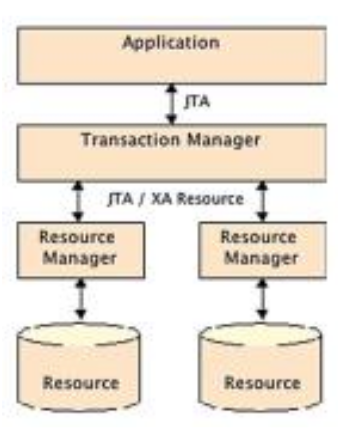

[Lezion10.pdf](/slides/10_2_EJB_1_NEW.pdf)

# Ciclo di vita degli EJB

## Le Transizioni per gli Stateless
1. Il ciclo di vita inizia quando il client richiede un riferimento al bean. Il container crea una nuova istanza.
2. Alla creazione, vengono anche iniettate le dipendenze richieste
3. Se l'istanza appena creata ha un metodo annotato con @PostConstruct, il container lo invoca.
4. Invocazioni dei metodi da parte dei client
5. Il container invoca il metodo annotato con @PreDestroy, se esiste, e termina il ciclo di vita dell'istanza del bean.

## Le Transizioni per gli Stateful
1. Il ciclo di vita inizia quando il client richiede un riferimento al bean. Il container crea una nuova istanza.
2. Alla creazione, vengono anche iniettate le dipendenze richieste
3. Se l'istanza appena creata ha un metodo annotato con @PostConstruct, il container lo invoca.
4. Invocazioni dei metodi da parte dei client
5. Se il client resta in idle per un certo periodo di tempo, il container invoca il metodo @PrePassivate e rende passivo il bean in uno storage permanente
6. Se un client invoca un bean <<passivated>>, il container lo attiva riportandolo in memoria ed invoca il metodo annotato con @PostActivate, se esiste.
7. Se un client non invoca il bean all'interno del session timeout period, il container lo elimina.
8. Alternativamente al passo 7, se un client chiama un metodo annotato con @Remove, il container invocherà il metodo annotato con @PreDestroy, se esiste e termina il ciclo di vita del bean.

```java
@Stateful
public class ShoppingCartEJB {

    @Resource(lookup = "java:comp/defaultDataSource")
    private DataSource ds;

    private Connection connection;
    private List<Item> cartItems = new ArrayList<>();

    @PostConstruct
    @PostActivate
    private void init() {
        connection = ds.getConnection();
    }

    @PreDestroy
    @PrePassivate
    private void close() {
        connection.close();
    }

    //...//...

    @Remove
    public void checkout() {
        cartItems.clear();
    }
}
```

## Modello di Sicurezza
- Obiettivo: controllare l'accesso al codice di business
- L'autenticazione è gestita dal layer di presentazione (web) o dall'applicazione client.
  - che poi passano l'utente al layer EJB
  - che deve verificare se ha accesso al possibile metodo, basato su ruolo
- L'autorizzazione può avvenire in maniera dichiarativa (dall'EJB Container) oppure da programma, attraverso Java Authentication and Authorization Service (JAAS API)

### Autorizzazione Dichiarativa
- Definita usando annotazioni oppure XML Deployment Descriptor.
- Richiede di:
  - definire ruoli
  - assegnare permessi ai metodi
  - cambiare temporaneamente una security identity
```java
@Stateless
@RolesAllowed({"user", "employee", "admin"}) // Definisce i ruoli autorizzati per accedere a questo EJB
public class ItemEJB {

    @PersistenceContext(unitName = "chapter08PU") // Inietta l'EntityManager per gestire le operazioni di persistenza
    private EntityManager em;

    /**
     * Trova un libro in base al suo ID.
     * @param id L'ID del libro da cercare.
     * @return Il libro trovato, oppure null se non esiste.
     */
    public Book findBookById(Long id) {
        return em.find(Book.class, id); // Utilizza l'EntityManager per cercare il libro nel database
    }

    /**
     * Crea un nuovo libro nel database.
     * @param book L'oggetto Book da persistere.
     * @return Il libro creato, con eventuali modifiche apportate dal database (ad esempio, ID generato).
     */
    public Book createBook(Book book) {
        em.persist(book); // Persistente il nuovo libro nel database
        return book; // Restituisce l'oggetto Book appena creato
    }

    /**
     * Elimina un libro dal database.
     * Solo gli utenti con ruolo "admin" possono eseguire questa operazione.
     * @param book L'oggetto Book da eliminare.
     */
    @RolesAllowed("admin") // Assegna permessi specifici per il metodo deleteBook
    public void deleteBook(Book book) {
        em.remove(em.merge(book)); // Rimuove il libro dal database dopo averlo unito (merge) per garantire che sia gestito dall'EntityManager
    }
}
```

### Autorizzazione Programmatica
- Permette una grana più fine nel controllo:
  - ad esempio, per blocchi di programma oppure per uno specifico utente.
- Si usano direttamente le API di Java Authentication and Authorization Service (JAAS)
- Interfaccia java.security.Principal insieme al contesto del JavaBean
- L'interfaccia SessionContext offre metodi per verificare che se:
  - chi chiama il metodo ha un certo ruolo
  - oppure verifica l'utente stesso

```java
@Stateless // Indica che questo EJB è stateless (senza stato)
public class ItemEJB {

    @PersistenceContext(unitName = "chapter08PU") // Inietta l'EntityManager per gestire le operazioni di persistenza
    private EntityManager em;

    @Resource // Inietta il contesto della sessione, utile per la gestione della sicurezza
    private SessionContext ctx;

    /**
     * Elimina un libro dal database.
     * Solo gli utenti con ruolo "admin" possono eseguire questa operazione.
     * @param book L'oggetto Book da eliminare.
     */
    public void deleteBook(Book book) {
        // Verifica se l'utente chiamante ha il ruolo "admin"
        if (!ctx.isCallerInRole("admin")) {
            throw new SecurityException("Only admins are allowed"); // Lancia un'eccezione se non ha il ruolo necessario
        }
        em.remove(em.merge(book)); // Rimuove il libro dal database
    }

    /**
     * Crea un nuovo libro nel database.
     * Assegna un valore al campo "createdBy" in base al ruolo dell'utente.
     * @param book L'oggetto Book da persistere.
     * @return Il libro creato, con eventuali modifiche apportate dal database.
     */
    public Book createBook(Book book) {
        // Controlla se l'utente ha il ruolo "employee" e non è un admin
        if (ctx.isCallerInRole("employee") && !ctx.isCallerInRole("admin")) {
            book.setCreatedBy("employee only"); // Imposta il creatore come "employee only"
        } else if (ctx.getCallerPrincipal().getName().equals("paul")) {
            book.setCreatedBy("special user"); // Imposta il creatore come "special user" se l'utente è "paul"
        }
        em.persist(book); // Persistente il nuovo libro nel database
        return book; // Restituisce l'oggetto Book appena creato
    }
}

```

# Transazioni
- I dati sono cruciali per il business e vanno mantenuti in maniera coerente.
  - ad esempio: quando si fa un bonifico bancario, i soldi dal conto di uno vanno inseriti nel conto dell'altro, come un'unica operazione.
- Una transazione rappresenta un insieme di operazioni logiche che devono essere realizzate come una singola unità di lavoro.
- Le operazioni vanno ovviamente realizzate separatamente e, se vanno tutte a buon fine, la transazione va a buon fine (commit)
  - Altrimenti si deve riportare tutto a com'era prima che iniziasse la transazione (rollback)
- Proprietà ACID: Atomicità, Cosistenza, Isolamento e Durabilità.

<table>
<tr>
<th> Transazioni Locali in JTA </th>
<th> Transazioni Distribuite </th>
</tr>
<tr>
<td>

- Esempio semplice di applicazione su una risorsa singola (DB)
- Transaction Manager(TM): componente core che gestisce le operazioni, informa il RM chi partecipa nella transazione
- Resource Manager(RM): responsabile della gestione delle risorse e della loro registrazione con il transaction manager.
  - driver, risorse JMS...
- Risorsa: persistent storage da cui leggere o scrivere 
  - DB, messaggi...

</td>
<td>

- Quando ci sono più risorse coinvolte, ad esempio diversi DB
- Coordinamento usando EXtended Architecture (XA) per Distributed Transaction Processing
- JTA supporta XA (eterogeneità vendor)
- Tecnica del two-phase commit: step di preparazione
  
</td>
</tr>
</table>

## Transazioni Distribuite
- Supponiamo di effettuare un bonifico.
  - prelevo 1000€ dal primo conto: transazione completata con successo
  - accredito sul secondo conto: transazione fallita
  - è necessario annullare la transazione sul conto che è stato addebitato.
- Bisogna usare il two-phase commit per evitare queste inconsistenze!

### Two Phase Commit
- Durante la fase 1, ogni Resource Manager viene notificato con un comando "prepare" che un commit sta per essere eseguito
- Se tutti dichiarano che sono "prepared", la transazione può avvenire ed ai resource manager viene chiesto di fare commit nella seconda fase


## Container-Managed Transactions
- Delega completa della gestione delle transazioni al container
- Il programmatore non sviluppa codice JTA
- I servizi vengono forniti ai session beans
- Gli EJB sono per loro natura transazionali: configuration by exception
```java
@Stateless // Indica che questo EJB è stateless (senza stato)
public class ItemEJB {

    @PersistenceContext(unitName = "chapter09PU") // Inietta l'EntityManager per gestire le operazioni di persistenza
    private EntityManager em;

    @Inject // Inietta un'altra EJB, InventoryEJB, per gestire l'inventario
    private InventoryEJB inventory;

    /**
     * Trova tutti i libri nel database.
     * @return Una lista di oggetti Book trovati.
     */
    public List<Book> findBooks() {
        // Crea una query tipizzata per trovare tutti i libri
        TypedQuery<Book> query = em.createNamedQuery("FIND_ALL", Book.class);
        return query.getResultList(); // Restituisce la lista dei risultati
    }

    /**
     * Crea un nuovo libro nel database e lo aggiunge all'inventario.
     * @param book L'oggetto Book da persistere.
     * @return Il libro creato, con eventuali modifiche apportate dal database.
     */
    public Book createBook(Book book) {
        em.persist(book); // Persistente il nuovo libro nel database
        inventory.addItem(book); // Aggiunge il libro all'inventario tramite l'EJB InventoryEJB
        return book; // Restituisce l'oggetto Book appena creato
    }
}

```


## Bean-Managed Transactions

```java
@Stateless // Indica che questo EJB è stateless (senza stato)
@TransactionManagement(TransactionManagementType.BEAN) // Gestione delle transazioni a livello di bean
public class InventoryEJB {

    @PersistenceContext(unitName = "chapter09PU") // Inietta l'EntityManager per gestire le operazioni di persistenza
    private EntityManager em;

    @Resource // Inietta l'oggetto UserTransaction per gestire le transazioni manualmente
    private UserTransaction ut;

    /**
     * Gestisce la vendita di un articolo, aggiornando lo stock e inviando notifiche.
     * @param item L'oggetto Item da elaborare.
     */
    public void oneItemSold(Item item) {
        try {
            ut.begin(); // Inizia una nuova transazione
            item.decreaseAvailableStock(); // Diminuisce lo stock disponibile dell'articolo
            sendShippingMessage(); // Invia un messaggio di spedizione

            // Controlla il livello di inventario dell'articolo
            if (inventoryLevel(item) == 0) {
                ut.rollback(); // Se lo stock è a zero, annulla la transazione
            } else {
                ut.commit(); // Altrimenti, conferma la transazione
            }
        } catch (Exception e) {
            ut.rollback(); // In caso di eccezione, annulla la transazione
        }

        sendInventoryAlert(); // Invia un avviso sull'inventario, indipendentemente dall'esito della transazione
    }
}

```
