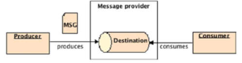

[lezione11.pdf](/slides/11_1_Messaging.pdf)

# Comprendere i messaggi
- MOM (Message Oriented Middleware) è un software (provider) che permette lo scambio di messaggi asincroni fra sistemi eterogenei
- Può essere visto come un buffer che produce e consuma messaggi
- È intrinsecamente loosely coupled dal momento che i produttori non sanno chi è all'altra estremità del canale di comunicazione a consumare il messaggio.
- Il produttore e consumatore non devono essere disponibili contemporaneamente per comunicare.
<br>
- Quando un messaggio viene inviato, il software che memorizza il messaggio e lo invia è detto **Provider**
- Il sender del messaggio è chiamato **Producer** e la localizzazione in cui il messaggio è memorizzato è detta **destinazione**
- La componente che riceve il messaggio è detta **Consumer**
- Ogni componente interessata ad un messaggio in una particolare destinazione può consumarlo.



## Java Message Service (JMS)
- In Java EE, l'API che gestisce questi concetti è Java Message Service
    - set di interfacce e classi per:
        - connettersi ad un provider
        - creare un messaggio
        - inviare un messaggio
        - ricevere un messaggio
- In un EJB container, Message-Driven Beans possono essere usati per ricevere messaggi in **container-managed way**

## Architettura
- Provider: componente necessaria per instradare i messaggi (gestisce buffering e delivery dei messaggi)
    - permette una comunicazione **asincrona** fornendo una destinazione dove i messaggi possono essere mantenuti finché non vengono instradati verso un client.
    - esistono 2 tipi di destinations:
        - __Point-to-Point__ (P2P): la destinazione è chiamata **coda**
            - il client mittente inserisce un messaggio in coda, un altro client riceve il messaggio.
            - il destinatario fa acknowledge della ricezione (lo consuma), il Message Provider rimuove il messaggio dalla coda.
            - per ogni messaggio esiste un unico receiver.
            - una coda può avere consumers multipli ma il primo che lo consuma lo fa eliminare dalla coda, quindi nessun altro potrà leggerlo.
            - **non** è garantito che i messaggi siano instradati in un particolare ordine
            - **Non vi sono dipendenze temporali**
            - Il consumo è influenzato da priorità, selezioni ecc...
            - I sender e receiver possono essere aggiunti dinamicamente a runtime
            - **Garantisce la corretta ricezione dei messaggi ai destinatari**
        - __Publish-subscribe__: la destinazione è chiamata **topic**
            - il messaggio possiede un topic, come un tag, tutti i sottoscritti al topic riceveranno il messaggio
            - gli iscritti (i Consumers) sono chiamati subscribers
            - il subscribing/unsubscribing può occorrere dinamicamente.
            - **Dipendenza temporale fra publisher e subscriber**
            - Multipli subscribers possono consumare lo stesso messaggio
            - I messaggi vengono inviati in broadcast senza che i consumer ne facciano esplicita richiesta
            - Utile per applicazioni broadcast-type
- Client: applicazione Java o componente che produce o consuma messaggi da/per un provider
    - aka: producer, sender, publisher, consumer, receiver, subscriber...
- Messaggi: oggetti che i client inviano/ricevono dal provider
- Administered Objects: oggetti forniti attraverso JNDI lookups o injections.

## Administered Objects
- Oggetti che si configurano amministrativamente, non programmaticamente.
- Il Provider permette di configurare questi oggetti e li rende disponibili nello spazio dei nomi JDBC
- Come JDBC datasources questi oggetti vengono creati solo una volta. I due tipi sono:
    - Connection Factory: usato dai client per creare una connessione a una destinazione
    - Destinazioni: punti di distribuzione del messaggio che ricevono, mantendono e distribuiscono
        - P2P o pub-sub

## Message-Driven Beans
- Un Message-Driven Bean (MDBs) sono message consumer asincroni eseguiti in un EJB Container.
- L'EJB si occupa dei servizi (transactions, security, concurrency, message acknowledgment...) mentre l'MDB si occupa di consumare messaggi
- Sono Stateless
    - Può avere numerose istanze, eseguite in concorrenza per processare messaggi provenienti da diversi producers.
- In generale gli MDBs sono in ascolto su una destination (queue o topic) e, quando il messaggio arriva, lo consuma e lo processa.
- Poiché sono stateless, gli MDBs non mantengono stato attraverso invocazioni separate

---

### **Message-Driven Beans (MDBs):**
- **Rispondono a messaggi ricevuti dal container:** Gli MDB sono progettati per elaborare messaggi asincroni provenienti da una coda o un argomento (tipicamente gestiti da un provider JMS - Java Message Service).
  - Non interagiscono direttamente con i client.
  - Il container Java EE gestisce l'arrivo dei messaggi e richiama l'MDB per processarli.
  - Esempio di utilizzo: un sistema di notifiche che elabora messaggi in background o processi batch.

### **Stateless Session Beans (SLSB):**
- **Rispondono a richieste client attraverso un'interfaccia appropriata:** 
  - Gli SLSB sono componenti EJB (Enterprise JavaBeans) che forniscono logica di business senza mantenere lo stato tra le richieste.
  - Sono invocati direttamente dai client (può essere un'applicazione front-end, un altro EJB, o persino un servizio esterno) tramite interfacce:
    - **Local:** Il bean è accessibile solo nello stesso ambiente JVM.
    - **Remote:** Il bean è accessibile da client remoti.
    - **No-interface:** Non richiede un'interfaccia dedicata; si usa direttamente il bean tramite annotazioni come `@Stateless`.

---

### Differenze principali
| **Caratteristica**               | **Message-Driven Bean (MDB)**           | **Stateless Session Bean (SLSB)**      |
|-----------------------------------|-----------------------------------------|----------------------------------------|
| **Origine delle richieste**       | Messaggi (asincroni) da JMS             | Invocazioni dirette da client (sincroni o asincroni) |
| **Interazione diretta con client**| No                                      | Sì                                     |
| **Interfaccia necessaria**        | No (implementa un'interfaccia specifica del messaggio) | Sì (local, remote o no-interface)     |
| **Uso tipico**                    | Elaborazione di messaggi in background  | Logica di business senza stato         |

---

## JMS API
- Definisce un insieme di interfacce e classi per la comunicazione con altri message providers.
- Analogamente a JDBC
    - permette la connessione a diversi database (MySQL, Derby...)
    - permette la connessione a diversi providers (OpenMQ, MQSeries...)

## Connection Factory
- **Connection**: astrazione di una connessione attiva di un JMS client con uno specifico JMS provider.
    - Incapsula una connessione aperta con il JMS provider.
    - Generalmente rappresentata da una connessione socket TCP aperta tra client e provider
    - Crea una sessione
    - Una connection implementa l'interfaccia ConnectionFactory
- Connection factories sono Administered Objects
<br><br>
- L'interfaccia javax.jms.ConnectionFactory incapsula parametri definiti da un amministratore.
- Per usare un administered object come una ConnectionFactory, il client deve eseguire una JNDI lookup (o usare injection)
```Java
Context = ctx = new InitialContext();
ConnectionFactory factory = (ConnectionFactory) ctx.lookup("jms/javaee7/ConnectionFactory")
```

## Destination
- Una destination è un administered object che contiene informazioni di configurazione provider-specific come il destination address.
- Questo meccanismo è nascosto dal JMS client attraverso l'uso dell'interfaccia javax.jms.Destination
 ```
 Context = ctx = new InitialContext();
Destination queue = (Destination) ctx.lookup("jms/javaee7/Queue")
 ```
 - Nel caso point-to-point la destinazione è rappresentata dall'interfaccia Queue
 - Nel caso pub-sub si usa l'interfaccia 'Topic'

 ## Messaggi
 - Possiedono: Header, Properties e Body
    - Header (obbligatorio): contiene informazioni sul messaggio
        - ID (univoco per ogni messaggio)
        - destinazione
        - priorità
        - expiration (tempo massimo in coda)
        - timestamp
        - tipo
        - persistent
        - ...
    - Properties (opzionale): coppie name/value
        - Permettono al client di chiedere solo messaggi con un certo criterio (Message Selectors)
    - Body (opzionale): contiene la parte informativa trasferita all'interno del messaggio
        - Stream, Map, Text, Object, Bytes

## Simplified API
- JMSContext: active connection ad un MS provider e single-threaded context per inviare e ricevere messaggi
- JMSProducer: oggetto creato da un JMSContext per inviare messaggi ad una coda o ad un topic
- JMSConsumer: oggetto creato da un JMSContext per ricevere messaggi inviati ad una coda o ad un topic

# Message Producers
- Il MessageProducer è l'oggetto che ha il compito di inviare messaggi ad una destination
- Implementa l'interfaccia MessageProducer ed è generato da una sessione attraverso il metodo createProducer() passandogli il nome logico della destination a cui il producer deve inviare i messaggi.

## Codificare Message Producers
Esempi:
- Produttore fuori da un container
- Produttore in un container
- Produttore in un container con CDI

### Produttore fuori da un container
- Un oggetto JMSProducer viene creato da un JMSContext e usato per inviare messaggi
- Passi da seguire:
    - Ottenere una connecton factory ed una coda con JNDI
    - Creare un JMSContext usando la factory
    - Creare un JMSProducer usando il contesto
    - Inviare un messaggio usando il metodo send() del producer
```Java
public class Producer {  
    // Classe Producer: un esempio di applicazione JMS per inviare un messaggio a una coda.
    public static void main(String[] args) {  
        try {  
            // Ottiene il contesto JNDI per cercare risorse registrate nel server applicativo.
            Context jndiContext = new InitialContext();  

            // Cerca la ConnectionFactory dal servizio JNDI. 
            // La ConnectionFactory è necessaria per creare connessioni JMS.
            ConnectionFactory connectionFactory = (ConnectionFactory)  
                    jndiContext.lookup("jms/javaee7/ConnectionFactory");  

            // Cerca la destinazione (coda JMS) dal servizio JNDI.
            // La coda è il punto in cui i messaggi verranno inviati.
            Destination queue = (Destination)  
                    jndiContext.lookup("jms/javaee7/Queue");  

            // Usa il ConnectionFactory per creare un JMSContext.
            // Il JMSContext è un'interfaccia semplificata per lavorare con JMS in Java EE.
            try (JMSContext context = connectionFactory.createContext()) {  
                // Crea un producer per inviare messaggi alla coda specificata.
                context.createProducer()  
                       .send(queue, "Text message sent at " + new Date());  
                // Invia un messaggio di testo con una stringa che include la data e l'ora correnti.
            }  
        } catch (NamingException e) {  
            // Gestisce eccezioni legate alla ricerca delle risorse JNDI.
            e.printStackTrace();  
        }  
    }  
}

```

### Produttore in un container
```Java
// La classe è annotata con @Stateless, quindi è un EJB senza stato.
// Questo significa che non mantiene dati persistenti tra le chiamate client.
@Stateless  
public class ProducerEJB {  

    // Il container inietta la ConnectionFactory usando @Resource.
    // Questa ConnectionFactory permette di creare connessioni JMS.
    @Resource(lookup = "jms/javaee7/ConnectionFactory")  
    private ConnectionFactory connectionFactory;  

    // Il container inietta una coda JMS usando @Resource.
    // Questa è la destinazione (Queue) dove verranno inviati i messaggi.
    @Resource(lookup = "jms/javaee7/Queue")  
    private Queue queue;  

    // Metodo pubblico che invia un messaggio a una coda JMS.
    public void sendMessage() {  
        // Usa un blocco try-with-resources per gestire automaticamente la chiusura del JMSContext.
        try (JMSContext context = connectionFactory.createContext()) {  
            // Crea un producer JMS e invia un messaggio di testo alla coda specificata.
            context.createProducer()  
                   .send(queue, "Text message sent at " + new Date());  
            // Il messaggio include una stringa con la data e l'ora attuali.
        }  
    }  
}

```

### Produttore in un container con CDI
```Java
public class Producer {  
    // Inietta automaticamente un JMSContext utilizzando @Inject.
    // Specifica la ConnectionFactory da usare tramite @JMSConnectionFactory.
    // Il container si occupa di creare, configurare e gestire il ciclo di vita del JMSContext.
    @Inject  
    @JMSConnectionFactory("jms/javaee7/ConnectionFactory")  
    private JMSContext context;  

    // Inietta una coda JMS (Queue) utilizzando @Resource.
    // La coda viene cercata tramite il nome JNDI fornito.
    @Resource(lookup = "jms/javaee7/Queue")  
    private Queue queue;  

    // Metodo di business che invia un messaggio alla coda JMS.
    public void sendMessage() {  
        // Utilizza il JMSContext iniettato per creare un producer JMS.
        // Invia un messaggio di testo alla coda specificata, includendo la data e l'ora attuali.
        context.createProducer().send(queue, "Text message sent at " + new Date());  
    }  
}

```

# Message Consumer
- È l’oggetto che ha il compito di ricevere i messaggi provenienti da una destination
- Sincroni: il ricevitore esplicitamente preleva il messaggio dalla destinazione, invocando receive()
- Asincroni: il ricevitore si registra all’evento di arrivo di un messaggio e
implementa MessageListener, in modo che all’arrivo del messaggio viene
invocato il suo metodo onMessage()

### Consumer Sincrono
- Richiede esplicitamente alla destinazione di prelevare il messaggio (fetch) invocando il metodo receive()
- Il metodo receive() appartiene all'interfaccia javax.jms.MessageConsumer e rimane bloccato fino alla ricezione del messaggio.
    - A meno della definizione di un timeout
```Java
public class Consumer {  
    public static void main(String[] args) {  
        try {  
            // Ottiene il contesto JNDI, che consente di cercare risorse configurate nel server applicativo.
            Context jndiContext = new InitialContext();  

            // Cerca la ConnectionFactory nel servizio JNDI.
            // La ConnectionFactory è necessaria per creare connessioni JMS.
            ConnectionFactory connectionFactory = (ConnectionFactory)  
                    jndiContext.lookup("jms/javaee7/ConnectionFactory");  

            // Cerca la destinazione JMS (in questo caso, una coda) nel servizio JNDI.
            // La coda è il punto da cui verranno ricevuti i messaggi.
            Destination queue = (Destination)  
                    jndiContext.lookup("jms/javaee7/Queue");  

            // Crea un JMSContext utilizzando la ConnectionFactory.
            // Questo oggetto rappresenta il contesto per la comunicazione JMS e semplifica l'uso delle API JMS.
            try (JMSContext context = connectionFactory.createContext()) {  

                // Ciclo infinito per consumare messaggi dalla coda in modo sincrono.
                while (true) {  
                    // Crea un consumer JMS per la coda specificata.
                    // Riceve il corpo del messaggio come stringa.
                    String message = context.createConsumer(queue).receiveBody(String.class);  

                    // (Puoi aggiungere qui un'operazione, ad esempio stampare il messaggio o processarlo.)
                    System.out.println("Received message: " + message);  
                }  
            }  
        } catch (NamingException e) {  
            // Gestisce eccezioni legate alla ricerca delle risorse JNDI.
            e.printStackTrace();  
        }  
    }  
}

```

### Consumer Asincrono
```Java
// La classe implementa l'interfaccia MessageListener, che fornisce la capacità di gestire messaggi JMS in modo asincrono.
public class Listener implements MessageListener {  

    // Metodo principale: avvia l'applicazione che registra un listener per messaggi JMS.
    public static void main(String[] args) {  
        try {  
            // Ottiene il contesto JNDI, necessario per cercare risorse configurate nel server applicativo.
            Context jndiContext = new InitialContext();  

            // Cerca la ConnectionFactory tramite il servizio JNDI.
            // La ConnectionFactory è utilizzata per creare connessioni JMS.
            ConnectionFactory connectionFactory = (ConnectionFactory)  
                    jndiContext.lookup("jms/javaee7/ConnectionFactory");  

            // Cerca la destinazione JMS (in questo caso, una coda) tramite il servizio JNDI.
            // La coda rappresenta la destinazione dei messaggi.
            Destination queue = (Destination)  
                    jndiContext.lookup("jms/javaee7/Queue");  

            // Crea un JMSContext utilizzando la ConnectionFactory.
            // Questo rappresenta il contesto per la comunicazione JMS.
            try (JMSContext context = connectionFactory.createContext()) {  

                // Crea un consumer JMS per la coda e registra un listener.
                // Il listener sarà un'istanza della classe `Listener` stessa.
                context.createConsumer(queue).setMessageListener(new Listener());  
            }  
        } catch (NamingException e) {  
            // Gestisce eccezioni legate alla ricerca delle risorse JNDI.
            e.printStackTrace();  
        }  
    }  

    // Metodo `onMessage`: viene chiamato automaticamente quando arriva un messaggio.
    @Override  
    public void onMessage(Message message) {  
        try {  
            // Elabora il messaggio ricevuto.
            // Qui si stampa il corpo del messaggio, supponendo che sia di tipo String.
            System.out.println("Async Message received: " + message.getBody(String.class));  
        } catch (JMSException e) {  
            // Gestisce eventuali errori durante l'elaborazione del messaggio.
            e.printStackTrace();  
        }  
    }  
}

```