[lezione11.pdf](/slides/11_2_Messaging.pdf)

# Meccanismi di Affidabilità
JMS definisce diversi livelli di affidabilità per assicurare che i messaggi siano instradati correttamente, anche se il provider va in crash o è sotto carico elevato.
- **Filtering Messages**: usando i selector è possibile ricevere solo i messaggi che si desiderano
- **Setting message time-to-live**: scegliere il time to live (expiration time) in modo da non instradare messaggi se obsoleti
- **Specifying message persistence**: specificare la persistenza di messaggi (nonostante malfunzionamento del provider)
- **Creating durable subscribers**: assicurare instradamento di messaggi verso un "unavailable" subscriber in un pub-sub model
- **Setting priorities**: priorità di messaggi

## Filtering Messages
- Non si ha spreco di banda per ricevere cose non di interesse
- Si può fare selezione su headers o metadati (JMSPriority < 6) o su proprietà custom (orderAmount < 200)
- Il message selector è una stringa che contiene un'espressione
```Java
// alcuni esempi di consumatori
context.createConsumer(queue, "JMSPriority < 6").receive();
context.createConsumer(queue, "JMSPriority < 6 AND orderAmount < 200").receive();
context.createConsumer(queue, "orderAmount BETWEEN 1000 AND 2000").receive();
```
- Il messaggio viene creato dal Producer usando metodi per settare proprietà e priorità
```Java
// alcuni esempi di produttori
context.createTextMessage().setIntProperty("orderAmount", 1530);
context.createTextMessage().setJMSPriority(5);
```

### Selector Expressions
- Operatori logici (NOT, AND, OR)
- Operatori di comparazione (=, <, >, <=, >=)
- Operatori aritmetici (+, -, *, /)
- espressioni ( [NOT] BETWEEN, [NOT] IN, [NOT] LIKE, IS [NOT] NULL ) 

## Setting message time-to-live
- Si setta il tempo in millisecondi, passato il quale il provider (broker) rimuove il messaggio
```Java
context.createProducer().setTimeToLive(1000).send(queue, message);
```
## Specifying message persistence
- JMS supporta 2 modalità di message delivery:
    - Persistent: messaggio salvato sul provider (disk/database)
        - È il valore di default
    - Non-Persistent: messaggio non salvato

```Java
context.createProducer().setDeliveryMode(DeliveryMode.NON_PERSISTENT).send(queue, message);
```

## Creating durable subscribers
- Si vuole ricevere una verifica del recapito del messaggio al destinatario.
    - AUTO_ACKNOWLEDGMENT: la sessione automaticamente fa ack di un messaggio
    - CLIENT_ACKNOWLEDGMENT: ack esplicito del client
        - chiamanado il metodo Message.acknowledge()
```Java
// Producer:
@Inject
@JMSConnectionFactory("jms/connectionFactory")
@JMSSessionMode(JMSContext.AUTO_ACKNOWLEDGE)
private JMSContext context;
    // ...
context.createProducer().send(queue, message);
// 
//
// Consumer
message.acknowledge();
```
---
- Nel modello publish-subscribe un consumer che non è in esecuzione perde i messaggi che vengono postati sul topic
- Con i **durable consumer** si può controllare che i messaggi vengano mantenuti dal provider fino a quando tutti i consumer li hanno ricevuti
    - i consumer che si riconnettono ricevono i messaggi che sono arrivati durante la sua assenza
    - creazione attraverso JMSContext con una id 'unica'
```Java
// topic: il canale su cui i messaggi sono pubblicati
context.createDurableConsumer(topic, "uniqueID").receive();

context.createDurableConsumer(topic, "javaee7DurableSubscription").receive()
```
- Quando si crea un durable consumer si registra una "durable subscription" presso il broker JMS con un nome univoco. Questo nome viene usato dal broker per salvare i messaggi mentre si è offline
- Ogni durable consumer deve impostare un client ID per il durable subscriber

## Setting priorities
- Si istruisce il JMS Provider a fare il delivery di messaggi urgenti per primi
- Contenute nell'header del messaggio
- Valori da 0 (basso) a 9 (alto)
```Java
context.createProducer().setPriority(2).send(queue, message);
```
Concateniamo diversi meccanismi
```Java
context.createProducer().setPriority(2).setTimeToLive(1000).setDeliveryMode(DeliveryMode.NON_PERSISTENT).send(queue, message);
```

# Message Driven Beans
- Sono consumatori di messaggi, asincroni, invocati dal container quando arriva un messaggio
- Parte delle specifiche di Enterprise Java Bean: simili a stateless
- Tramite CDI può accedere ad altri EJB, JDBC, risorse JMS, entity manager...
- Perché usare un MDB invece di un JMS Client?
    - transazioni, multithread, sicurezza gestiti dal container
<br><br>
- annotato con @javax.ejb.MessageDriven
- non deve avere il metodo finalize()
- Deve esserci un costruttore senza argomenti per permetterne l'istanziazione automatica da parte del container
- Definito come public
- Implementa l'interfaccia del listener

```Java
// Definizione di un Message-Driven Bean (MDB), un componente EJB che riceve ed elabora messaggi JMS in modo asincrono.
@MessageDriven(mappedName = "jms/javaee7/Topic")  
public class BillingMDB implements MessageListener {  

    // Implementazione del metodo `onMessage`, definito dall'interfaccia `MessageListener`.
    // Questo metodo viene chiamato automaticamente quando arriva un messaggio nella destinazione configurata.
    public void onMessage(Message message) {  

        try {  
            // Stampa il corpo del messaggio ricevuto, assumendo che sia di tipo String.
            // `getBody(String.class)` estrae il contenuto del messaggio nel tipo specificato.
            System.out.println("Received:" + message.getBody(String.class));  
        } catch (JMSException e) {  
            // Gestione delle eccezioni che possono verificarsi durante l'elaborazione del messaggio.
            e.printStackTrace();  
        }  
    }  
}  

```
```Java
// Definizione di un Message-Driven Bean (MDB) con configurazioni aggiuntive.
// Questo MDB riceve messaggi da un topic JMS configurato tramite JNDI.
@MessageDriven(
    mappedName = "jms/javaee7/Topic", // Specifica il nome JNDI del Topic a cui si iscrive il MDB.
    activationConfig = { // Configurazioni specifiche per l'attivazione del MDB.
        // Configura la modalità di acknowledgment dei messaggi JMS.
        @ActivationConfigProperty(
            propertyName = "acknowledgeMode",
            propertyValue = "Auto-acknowledge" // Il server conferma automaticamente i messaggi ricevuti.
        ),
        // Configura un filtro (message selector) per elaborare solo messaggi che soddisfano una condizione.
        @ActivationConfigProperty(
            propertyName = "messageSelector",
            propertyValue = "orderAmount < 3000" // Riceve solo messaggi con `orderAmount` inferiore a 3000.
        )
    }
)
public class BillingMDB implements MessageListener { // Implementazione di un MDB che gestisce messaggi JMS.

    // Metodo chiamato automaticamente quando arriva un messaggio.
    @Override
    public void onMessage(Message message) {  
        try {
            // Estrae e stampa il corpo del messaggio, presupponendo che sia di tipo String.
            System.out.println("Message received: " + message.getBody(String.class));  
        } catch (JMSException e) {  
            // Gestione delle eccezioni durante l'elaborazione del messaggio.
            e.printStackTrace();  
        }  
    }  
}

```

# Dependency Injection
- Come per tutti gli EJB, gli MDBs possono usare DependencyInjection per ottenere riferimenti a risorse come JDBC datasources, EJBs o altri oggetti
- Injection è il meccanismo attraverso il quale il container inserisce le dipendenze automaticamente dopo aver creato l'oggetto
- Queste risorse devono essere disponibili nel container oppure nell'environment context
```Java
@PersistenceContext
private EntityManager em;
@Inject
private InvoiceBean invoice;
@Resource(lookup = "jms/javaee7/ConnectionFactory")
private ConnectionFactory connectionFactory;

// possiamo injectare anche con l'annotazione @Resource
@Resource private MessageDrivenContext context;
```

### MessageDrivenContext
- fornisce accesso al runtime context, che il container fornisce per una istanza di un MDB
- il container passa l'interfaccia MessageDrivenContext all'istanza, che rimane associata per il lifetime dell'MDB
- Permette all'MDB di fare roll-back di una transazione, ottenere il caller (user principal), ecc...

## Ciclo di vita di un MDB
- Simile a quello degli stateless beans
- Possibile inserire interceptors dei metodi
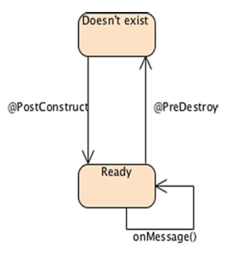
- Per natura, gli MDBs sono progettati per funzionare come asynchronous message consumers
- Gli MDBs implementano una message listener interface, che viene "risvegliata" dal container (triggered) quando un messaggio arriva.

### MDB consumers sincroni?
- Non è raccomandato
- Bloccano le risorse del server (gli EJBs si bloccheranno in un loop senza eseguire nessun lavoro ed il container non sarà in grado di liberarli)
- Gli MDBs, come gli stateless session beans, vivono in un pool di una certa taglia
    - quando il container ha bisogno di una istanza la prende dal pool e la usa
    - se l'istanza va in un loop infinito, il pool si svuoterà e tutte le risorse saranno bloccate in un busy looping
- L'EJB container può generare nuove istanze di MDB incrementando il pool ma aumentando così il consumo di memoria
- Per questa ragione, **session beans e MDBs non dovrebbero essere usati come synchronous message consumers**

### MDB Producers
- Gli MDBs possono ANCHE diventare message producers
    - Workflow che prevede che essi ricevano messaggi da una destinazione, li processino, li riinviino altrove.
- Per aggiungere questa capacità bisogna usare le API JMS
```Java
// Definizione di un Message-Driven Bean (MDB), un componente EJB che riceve ed elabora messaggi JMS in modo asincrono.
// Configurazioni aggiuntive includono modalità di acknowledgment e message selector.
@MessageDriven(
    mappedName = "jms/javaee7/Topic", // Nome JNDI del Topic JMS configurato.
    activationConfig = { 
        // Configura la modalità di acknowledgment dei messaggi JMS.
        @ActivationConfigProperty(
            propertyName = "acknowledgeMode", 
            propertyValue = "Auto-acknowledge" // Acknowledgment automatico dei messaggi dopo la loro elaborazione.
        ),
        // Configura un filtro per selezionare solo i messaggi desiderati.
        @ActivationConfigProperty(
            propertyName = "messageSelector", 
            propertyValue = "orderAmount BETWEEN 3 AND 7" // Riceve solo messaggi con `orderAmount` compreso tra 3 e 7.
        )
    }
)
public class BillingMDB implements MessageListener { // Implementazione di un MDB che gestisce messaggi JMS.

    // Iniezione automatica del contesto JMS tramite l'annotazione `@Inject`.
    // La connessione viene gestita dal container EJB.
    @Inject
    @JMSConnectionFactory("jms/javaee7/ConnectionFactory") // Specifica la factory JMS da utilizzare.
    @JMSSessionMode(JMSContext.AUTO_ACKNOWLEDGE) // Configura la modalità di sessione con acknowledgment automatico.
    private JMSContext context; // Oggetto per inviare messaggi JMS.

    // Risorsa aggiuntiva per accedere a una coda di destinazione tramite JNDI.
    @Resource(lookup = "jms/javaee7/Queue") 
    private Destination printingQueue; // La coda dove inviare i messaggi successivi.

    // Metodo chiamato automaticamente quando arriva un messaggio.
    @Override
    public void onMessage(Message message) { 
        try {
            // Stampa il corpo del messaggio ricevuto.
            System.out.println("Message received: " + message.getBody(String.class)); 

            // Invia un messaggio alla coda `printingQueue` per segnalare che il messaggio è stato ricevuto.
            sendPrintingMessage(); 
        } catch (JMSException e) {
            // Gestione delle eccezioni in caso di problemi con l'elaborazione o l'invio.
            e.printStackTrace();
        }
    }

    // Metodo privato per inviare un messaggio alla coda di stampa (`printingQueue`).
    private void sendPrintingMessage() throws JMSException {
        // Utilizza il producer JMS per inviare un messaggio di conferma alla coda.
        context.createProducer().send(printingQueue, 
            "Message has been received and resent"); // Testo del messaggio inviato.
    }
}

```

# Transazioni, anche per i messaggi
- Transazioni per scambio di messaggi: un certo numero di messaggi vanno recapitati tutti insieme o nessuno
- In quanto EJB, le transazioni possono essere Bean-managed oppure Container-managed

# Esempio di un progettino
- Producer stand-alone, __OrderProducer__, invia messaggi a un topic, con un valore di amount (settato su linea di comando del producer) 
- Il consumer __OrderConsumer__ riceve tutti i messaggi
- L'MDB ExpensiveOrderMDB riceve solamente quelli sopra i 1000
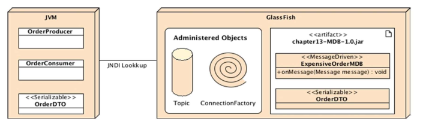

```Java
// Classe Data Transfer Object (DTO) per rappresentare un ordine.
// Implementa l'interfaccia Serializable, rendendo possibile la serializzazione
// e deserializzazione, necessaria per trasmettere oggetti attraverso la rete
// o per salvarli su disco.
public class OrderDTO implements Serializable {

    // Identificatore univoco per l'oggetto serializzato.
    // Necessario per garantire la compatibilità durante la deserializzazione.
    private static final long serialVersionUID = 1L;

    // Identificatore univoco dell'ordine.
    private Long orderId;

    // Data di creazione dell'ordine.
    private Date creationDate;

    // Nome del cliente che ha effettuato l'ordine.
    private String customerName;

    // Importo totale dell'ordine.
    private Float totalAmount;

    // Getter e setter per le proprietà (da aggiungere).

    // Costruttore predefinito (necessario per alcune tecnologie di serializzazione).
    public OrderDTO() {}

    // Costruttore completo per inizializzare tutti i campi.
    public OrderDTO(Long orderId, Date creationDate, String customerName, Float totalAmount) {
        this.orderId = orderId;
        this.creationDate = creationDate;
        this.customerName = customerName;
        this.totalAmount = totalAmount;
    }

    // Getter e setter per ogni campo.
    public Long getOrderId() {
        return orderId;
    }

    public void setOrderId(Long orderId) {
        this.orderId = orderId;
    }

    public Date getCreationDate() {
        return creationDate;
    }

    public void setCreationDate(Date creationDate) {
        this.creationDate = creationDate;
    }

    public String getCustomerName() {
        return customerName;
    }

    public void setCustomerName(String customerName) {
        this.customerName = customerName;
    }

    public Float getTotalAmount() {
        return totalAmount;
    }

    public void setTotalAmount(Float totalAmount) {
        this.totalAmount = totalAmount;
    }

    // Metodo `toString` per rappresentare l'oggetto come stringa leggibile.
    @Override
    public String toString() {
        return "OrderDTO{" +
               "orderId=" + orderId +
               ", creationDate=" + creationDate +
               ", customerName='" + customerName + '\'' +
               ", totalAmount=" + totalAmount +
               '}';
    }
}

```
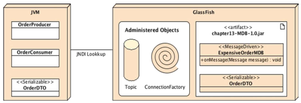

```Java
// Classe che funge da producer JMS, invia messaggi contenenti un ordine a un topic.
public class OrderProducer {

    // Metodo principale che avvia l'applicazione.
    public static void main(String[] args) throws NamingException {

        // Estrae il parametro dalla linea di comando e lo converte in un Float.
        // Questo parametro rappresenta l'importo totale dell'ordine.
        Float totalAmount = Float.valueOf(args[0]); 
        // Creazione di un nuovo oggetto `OrderDTO` con i dati dell'ordine.
        OrderDTO order = new OrderDTO(
            1234L,          // ID univoco dell'ordine.
            new Date(),     // Data corrente come data di creazione.
            "Betty Moreau", // Nome del cliente.
            totalAmount     // Importo totale dell'ordine (passato come parametro).
        );

        // Ottiene il contesto JNDI per cercare le risorse amministrate (JMS connection factory e topic).
        Context jndiContext = new InitialContext();

        // Cerca la factory per le connessioni JMS utilizzando il nome JNDI configurato.
        ConnectionFactory connectionFactory = (ConnectionFactory)
            jndiContext.lookup("jms/javaee7/ConnectionFactory");

        // Cerca il topic JMS dove inviare i messaggi.
        Destination topic = (Destination)
            jndiContext.lookup("jms/javaee7/Topic");

        // Crea un contesto JMS usando la connection factory.
        // Il contesto JMS è un wrapper per gestire connessioni, sessioni e producer in modo semplificato.
        try (JMSContext jmsContext = connectionFactory.createContext()) {

            // Crea un producer per inviare messaggi al topic.
            // Imposta una proprietà del messaggio (`orderAmount`) con l'importo totale.
            jmsContext.createProducer()
                .setProperty("orderAmount", totalAmount) // Proprietà per filtrare i messaggi (selezione lato consumer).
                .send(topic, order); // Invia il messaggio (un oggetto `OrderDTO`) al topic specificato.
        }
    }
}

```

```Java
// Classe JMS Consumer per ricevere messaggi da un topic contenenti oggetti OrderDTO.
public class OrderConsumer {
    
    // Metodo principale che avvia il consumer.
    public static void main(String[] args) throws NamingException {

        // Ottiene il contesto JNDI dall'ambiente di esecuzione.
        // Permette di cercare risorse amministrate (JMS ConnectionFactory e destinazioni).
        Context jndiContext = new InitialContext();

        // Esegue il lookup della ConnectionFactory, necessaria per creare connessioni JMS.
        ConnectionFactory connectionFactory = (ConnectionFactory)
            jndiContext.lookup("jms/javaee7/ConnectionFactory");

        // Esegue il lookup del topic JMS da cui ricevere i messaggi.
        Destination topic = (Destination)
            jndiContext.lookup("jms/javaee7/Topic");

        // Crea un contesto JMS utilizzando la ConnectionFactory.
        // Questo contesto semplifica la gestione di connessioni e sessioni.
        try (JMSContext jmsContext = connectionFactory.createContext()) {

            // Ciclo infinito per ricevere i messaggi dal topic.
            while (true) {
                // Crea un consumer per il topic e riceve i messaggi.
                // `receiveBody` deserializza il corpo del messaggio nel tipo specificato (OrderDTO).
                OrderDTO order = jmsContext.createConsumer(topic)
                    .receiveBody(OrderDTO.class);

                // Stampa l'oggetto ordine ricevuto nella console.
                System.out.println("Order received: " + order);
            }
        }
    }
}

```

```Java
// MDB (Message-Driven Bean) configurato per ascoltare un topic JMS
// e processare solo i messaggi con un importo superiore a 1000.
@MessageDriven(
    mappedName = "jms/javaee7/Topic", // Nome JNDI del topic a cui il MDB è associato.
    activationConfig = {
        // Configurazione automatica dell'acknowledge per i messaggi ricevuti.
        @ActivationConfigProperty(propertyName = "acknowledgeMode", 
                                  propertyValue = "Auto-acknowledge"),
        // Filtro messaggi: solo quelli con `orderAmount > 1000` vengono processati.
        @ActivationConfigProperty(propertyName = "messageSelector", 
                                  propertyValue = "orderAmount > 1000")
    }
)
public class ExpensiveOrderMDB implements MessageListener {

    // Metodo chiamato automaticamente quando arriva un messaggio valido.
    @Override
    public void onMessage(Message message) {
        try {
            // Estrae il corpo del messaggio come un oggetto di tipo OrderDTO.
            OrderDTO order = message.getBody(OrderDTO.class);

            // Stampa in console l'ordine ricevuto.
            System.out.println("Expensive order received: " + order.toString());

        } catch (JMSException e) {
            // Gestione delle eccezioni JMS durante l'elaborazione del messaggio.
            e.printStackTrace();
        }
    }
}

```

# Configurazione degli oggetti Administered
- Necessario che il server abbia:
    - Il Connection Factory
    - Il Topic
- Configurazione possibile da Console Web e da Linea di Comando
- Nella creazione del Topic è necessario anche creare la destinazione fisica (creata di default con linea di comando)

## Configurazione con Web Console
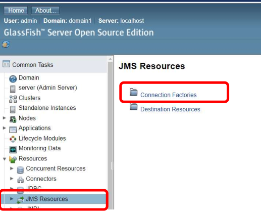
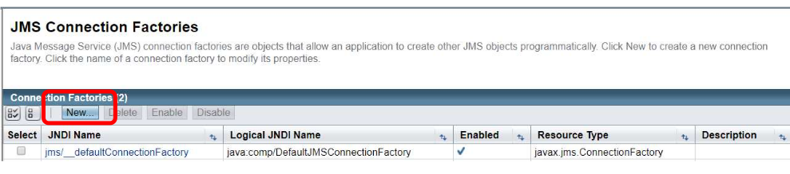
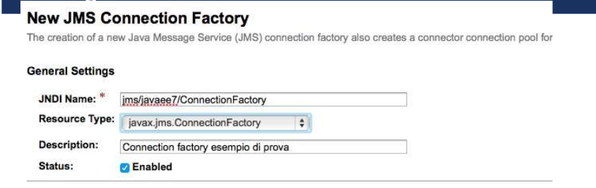
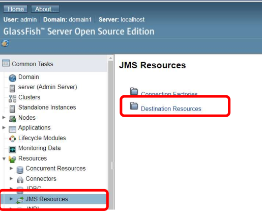
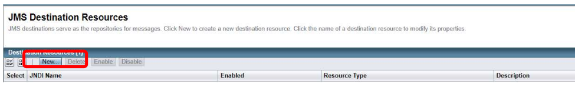
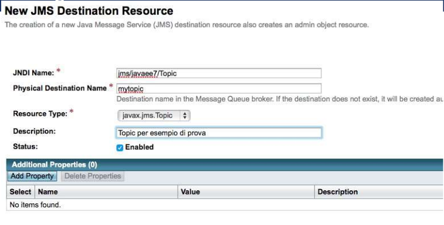

## Configurazione via CLI
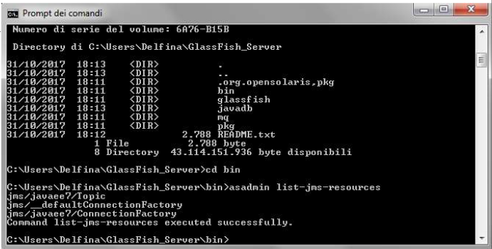
```Bash
# bisogna prima spostarsi nella directory bin
# cd bin 
asadmin create-jms-resource --restype javax.jms.ConnectionFactory jms/javaee7/ConnectionFactory

asadmin create-jms-resource --restype javax.jms.Topic jms/javaee7/Topic

# comandi utili:
list-jms-resources
```

## Per impratichirsi
Usare il progetto JMS(MDB)_Lab5 per vedere come funziona il tutto
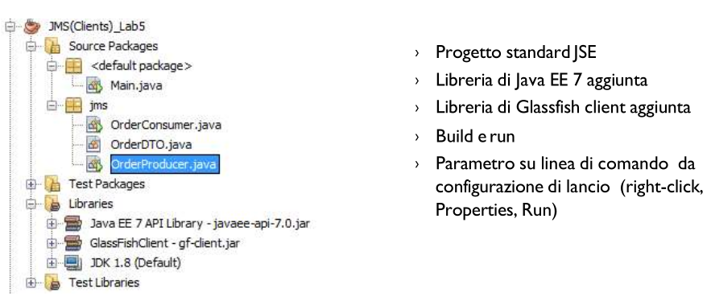