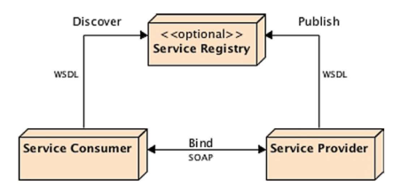
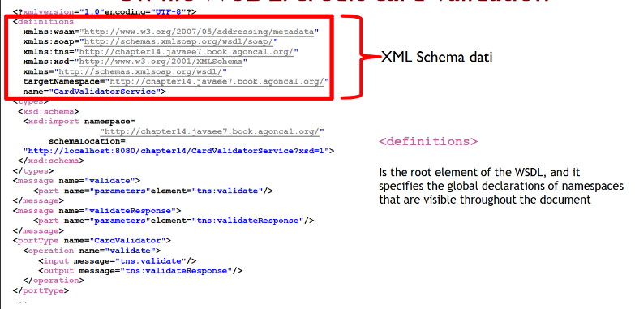
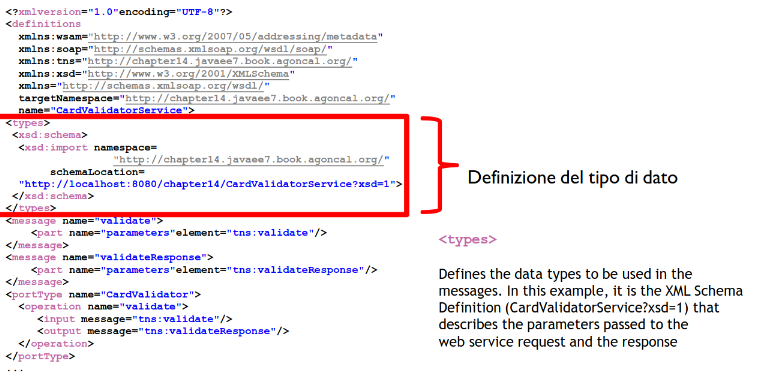
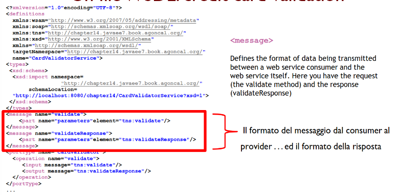
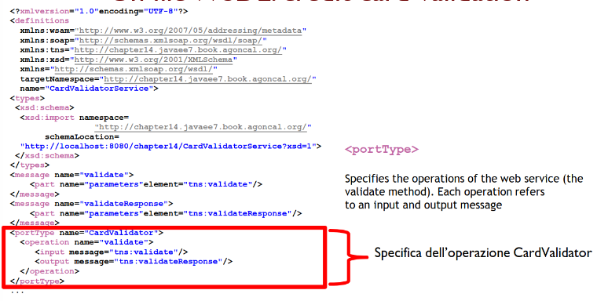
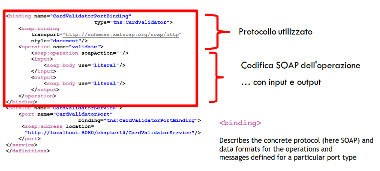
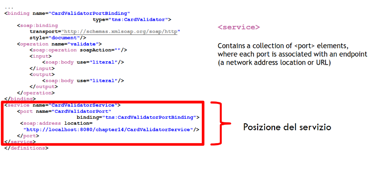
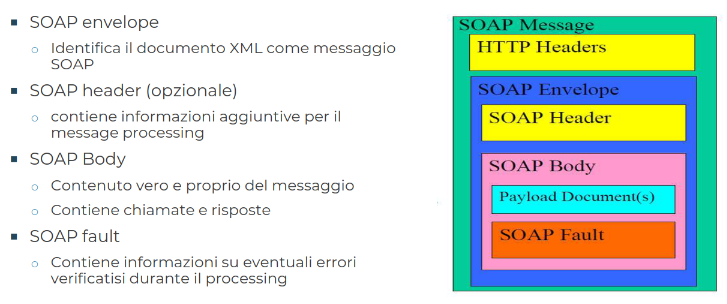
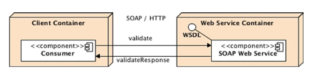
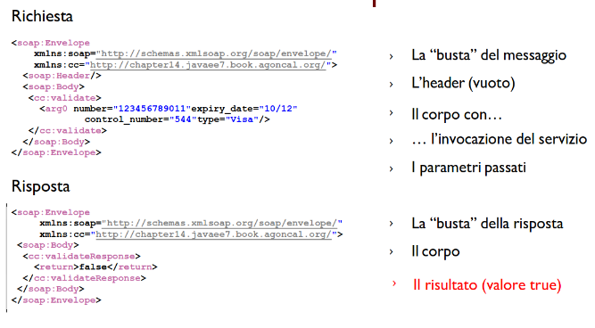

[lezione12.pdf](/slides/12_WS_1_NuoveAA2425.pdf)

# Service-Oriented Architecture
- La tecnologia a servizi è una tecnologia per l'integrazione di applicazioni distribuite.
    - volta a risolvere problemi pragmatici di interoperabilità
    - basata su standard accettati dalla maggior parte dei produttori di software
    - che focalizza l'attenzione sul concetto di servizio
- I Web Services rappresentano la tecnologia "più rappresentativa" in questo ambito.
<br><br>
- L'architettura orientata ai servizi (SOA) fornisce il contesto metodologico (e di business) in cui utilizzare al meglio le tecnologie basate sui servizi.
- I servizi sono self contained.
    - deployati su una piattaforma di middleware standard (Java EE)
    - che possono essere descritti, pubblicati localizzati ed invocati attraverso la rete.
- Ogni pezzo di codice oppure ogni componente di un'applicazione di cui è stato fatto il deploy su un sistema può essere trasformata in un servizio accessibile via rete.
- I servizi riflettono un nuovo "approccio" basato sull'idea di comporre applicazioni "scoprendo" ed invocando servizi sulla rete piuttosto che scrivere nuove applicazioni.
    - combinazione di funzionalità già esistenti
<br><br>
- I servizi eseguono funzioni che spaziano fra rispondere a semplici richieste fino all'eseguire complesse logiche di business
- I servizi sono scritti in modo di essere indipendenti dal contesto in cui sono usati
    - service providers e consumers sono debolmente accoppiati
- A livello middleware il loosely coupling richiede che l'approccio service-oriented sia indipendente dalle specifiche tecnologie o sistemi operativi
- Servizi e composizione di servizi sono indipendenti dai linguaggi di programmazione utilizzati
    - invocazione attraverso l'utilizzo di self-describing interfaces e standards.
<br><br>
- Attraverso l'utilizzo di standard
    - gli sviluppatori possono accedere a sistemi ed applicazioni sulla rete sulla base di quello che fanno
    - indipendentemente da come realizzano le loro funzionalità e come sono state implementate
<br><br>
- Affinché si possa parlare di Service-Oriented-Architecture, i servizi devono:
    - Essere neutrali alla tecnologia
        - Devono poter essere invocati attraverso tecnologie standard (protocollo, meccanismi di discovery) compliant con accepted standards.
    - Loosely Coupled
        - Nessuna conoscenza della struttura interna o convenzioni (context) sia a livello client che server
    - Supportare location transparency
        - Le definizioni e informazioni di localizzazione devono essere memorizzate in un repository (UDDI) ed accessibili a diversi client
        - che possono invocarli indipendentemente dalla locazione
- I servizi possono essere forniti su una singola macchina o su un gran numero di dispositivi distribuiti su:
    - una rete locale
    - una rete distribuita
- Un caso interessante è quello dei servizi che usano Internet come communication medium e open internet standard
    - I Web Services

## Cosa sono i Web Services
- Applicazioni che possono essere implementate usando diverse tecnologie
    - Simple Object Access Protocol (SOAP) e Representational State Transfer (REST).
- Concetto chiave: "loosely coupled"
    - Niente è conosciuto dai client (consumer) del servizio circa la sua implementazione
        - linguaggio usato per svilupparlo, la piattaforma che lo esegue...

## Il paradigma dei Web Services
- Costrutti per supportare lo sviluppo di applicazioni distribuite che siano:
    - veloci
    - basso costo
    - di facile composizione con altri servizi simili
- WS: logica di applicazione disponibile in maniera automatica ed esposta su internet.
- Approccio orientato ai servizi: un'applicazione scoprendo e invocando servizi disponibili sulla rete
    - invece di costruire nuove applicazioni o invocare applicazioni disponibili

## Requisiti di un Web Service
- Neutri rispetto alla tecnologia
    - ricondotti al minimo comun denominatore tecnologico per essere disponibile in tutti gli ambienti
- Debolmente accoppiati
    - nessuna conoscenza circa le strutture interne, il contesto da parte del client.
- Trasparenza alla locazione
    - definizione e locazione disponibile attraverso registri pubblici, che siano accessibili da un client generico

### W3C: definzione di Web Service
- è un sistema software progettato per supportaer interazioni interoperabili tra computer su una rete.
- l'interfaccia è specificata in una descrizione analizzabile automaticamente (come Web Service Definition Language)
- l'interoperabilità con gli altri sistemi aviene mediante messaggi SOAP, tipicamente attraverso una richiesta HTTP o Serializzazione XML
<br><br>
- Cosa fanno:
    - un task auto-contenuto (depositare fondi su un conto bancario)
    - un processo di business (acquisto automatico di forniture per ufficio)
    - un'applicazione (calcolo di previsioni su valore di azioni)
    - una risorsa accessibile mediante servizi (backend di un DB)

## Da non confondere
- I Servizi accessibili via Web usano un'interfaccia universale (browser) ma NON sono necessariamente Web Services
- I Web Services sono utilizzabili sia automaticamente da altre applicazioni sia da utenti
- Necessario rivedere il concetto di "Software as a Service" (SaaS)

### SaaS
- Apparso col modello software Application Service Provider (ASP)
    - Companies che combinano software e elementi infrastrutturali con servizi di business e professionali per fornire una soluzione completa ai customer sotto forma di servizio richiesto sulla base di una sottoscrizione.
    - Sono entità terze che eseguono il deploy, mantengono e gestiscono l'accesso a packaged applications e forniscono software-based services attraverso la rete a customer multipli

# Ruoli
- Service Provider
    - organizzatore che fornisce i servizi
- Service Registry
    - fornisce un repository di service descriptions (WSDL) pubblicati dal Service Provider
- Service Consumer
    - Fruitore dei servizi
        - individuo
        - applicazione



## Interazioni con i Web Services
- Il Web Service può essere (opzionalmente) registrato in un registro con Universal Description Discovery and Integration (UDDI)
- Quando il consumer conosce l'interfaccia del servizio e il formato del messaggio...
- ... può inviare una richiesta al provider del servizio e ricevere una risposta

## Ruolo di WSDL
- Serve a specificare l'interfaccia di un Web Service: il contratto garantito
- Ruolo di Interface Definition Language tra i consumer e il servizio (fornito dal provider)
- Fornisce informazioni su:
    - tipo di messaggio
    - porta
    - protocollo di comunicazione
    - operazioni supportate
    - posizione
    - cosa si aspetta il consumatore come valore di ritorno








# SOAP
- Simple Object Access Protocol
- È un protocollo per lo scambio di messaggi
- Fortemente basato su XML: i messaggi scambiati sono strutturati in diversi elementi (envelope, header, body) definiti in XML
- Usa HTTP come protocollo di scambio: richiesta HTTP corrisponde all'invio della richiesta del servizio, mentre la risposta HTTP corrisponde al risultato dell'invocazione
- Caratteristiche fondamentali: indipendente dalla piattaforma


- Envelope: definisce il messaggio ed il namespace usato nel documento. È un root element obbligatorio
- Header: contiene ogni attributo opzionale specifico all'applicazione legato all'infrastruttura, informazioni di sicurezza, routing di rete...
- Body: contiene il messaggio scambiato tra le applicazioni
- Fault: contiene le informazioni su errori generati durante il processamento del messaggio, è opzionale


## Continuando...
- WSDL descrive un'interfaccia del web service mentre SOAP fornisce una concreta implementazione definendo i messaggi XML scambiati fra il consumer ed il provider.
- Nel nostro esempio, quali sono i messaggi?
    - il consumer invia le informazioni relative alla carta di credito all'interno di un SOAP envelope (Listing 14-3) al metodo **validate** del web service **CardValidator**
    - il servizio restituisce un altro SOAP envelope (Listing 14-4) con il risultato della validazione (true o false)





# Esempio
## Servizio CardValidator
- la classe deve:
    - essere annotata con @WebService
    - implementare zero o più interfacce annotate con @WebService
    - essere pubblica
    - avere un costruttore pubblico di default
    - non avere un finalize()
    - essere annotata anche con @Stateless o @Singleton se si vuole rendere anche un EJB
        - un servizio è sempre stateless!
- JAX-WS permette quindi sia a classi regolari Java che EJBs di essere esposti come Web Services
    - guadagnando i servizi offerti per EJB e non per i WS (transazioni, sicurezza, interceptors... gestite in maniera autonoma)
    - è un approccio più efficiente, perché per consumer fortemente accoppiati (EJB via RMI-IIOP) sfrutta la comunicazione NATIVA del server applicativo e delle risorse Java EE, riducendo l'overhead
    - rende indipendente la piattaforma per consumer debolmente accoppiati (WS via SOAP), permettendo a client su altre piattaforme di consumare il servizio. Dovranno comunicare tra loro attraerso protocolli HTTP, XML e JSON, rendendo le interazioni meno efficienti rispetto alle chiamate dirette in Java EE.
```Java
@WebService
@Stateless
public class CardValidator
{
    public boolean validate(CreditCard creditCard) {
        Character lastDigit = creditCard.getNumber().charAt(
        creditCard.getNumber().length() - 1);
        if(Integer.parseInt(lastDigit.toString()) % 2 != 0) {
            return true;
        }else{
            return false;
        }
    }
}
```

## L'entità scambiata: CreditCard
```Java
@XmlRootElement
public class CreditCard
{
    @XmlAttribute(required = true)
    private String number;
    
    @XmlAttribute(name ="expiry_date", required = true)
    private String expiryDate;
    
    @XmlAttribute(name ="control_number", required = true)
    private Integer controlNumber;
    
    @XmlAttribute(required = true)
    private String type;
    
    //Constructors,getters,setters...
}
```