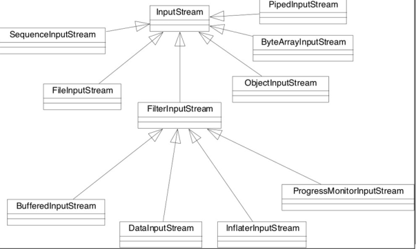
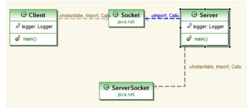
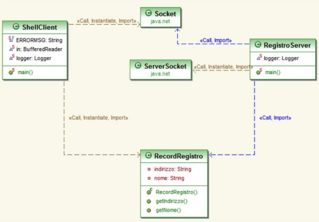

[Lezione3.pdf](/slides/3_Socket.pdf)

<!---
<table>
<tr>
<th> Good </th>
<th> Bad </th>
</tr>
<tr>
<td>

```java
int foo() {
    int result = 4;
    return result;
}
```

</td>
<td>

```java
int foo() { 
    int x = 4;
    return x;
}
```

</td>
</tr>
</table>
-->
# Socket

## Le Porte del TCP

I protocolli TCP e UDP usano le porte per mappare i dati in ingresso con un particolare processo attivo su un computer. Ogni socket è legato a un numero di porta così che il livello TCP può identificare l’applicazione a cui i dati devono essere inviati. 

A livello programmatico, un Socket è definito come un “identificativo univoco che rappresenta un canale di comunicazione attraverso cui l’informazione è trasmessa”. La comunicazione è indipendente dal linguaggio di programmazione. In questo modo, client e server devono solo concordare sul protocollo e numero di porta. 

## Come funzionano i socket

I Socket su Stream sono supportati da due classi:

- ServerSocket: accetta le connessione (socket di connessione)
- Socket: scambia i dati (socket di dati)

ServerSocket(int port)

Socket accept() throws IOException

public void close() throws IOException

void setSoTimeout(int timeout) throws SocketException

getInputStream() 

restituisce l’input stream associato al socket.

ObjectInputStream 

possiede readObject() 

ObjectOutputStream

writeObject()

## Gli Stream
Utilizziamo gli stream per trasferire i dati da qualche altra parte




<table>
<tr>
<th> Client </th>
<th> Server </th>
</tr>
<tr>
<td>

```Java
import java.io.*;
import java.net.*;
import java.util.logging.Logger;

public class Client {
    static Logger logger = Logger.getLogger("global");

    public static void main(String args[]) {
        try {
            Socket socket = new Socket("localhost", 9000);
            ObjectOutputStream out = new ObjectOutputStream(socket.getOutputStream());
            ObjectInputStream in = new ObjectInputStream(socket.getInputStream());

            out.writeObject("Delfina");
            System.out.println(in.readObject());

            socket.close();
        } catch (EOFException e) {
            logger.severe("Problem with the connection: " + e.getMessage());
            e.printStackTrace();
        } catch (Throwable t) {
            logger.severe("Throwable thrown: " + t.getMessage());
            t.printStackTrace();
        }
    }
}

```

</td>
<td>

```Java
import java.io.*;
import java.net.*;
import java.util.logging.Logger;

public class Server {
    static Logger logger = Logger.getLogger("global");

    public static void main(String[] args) {
        try {
            ServerSocket serverSocket = new ServerSocket(9000);
            logger.info("Socket ok, accepting connection...");
            Socket socket = serverSocket.accept();
            logger.info("Accepted a connection....");
            ObjectOutputStream oS = new ObjectOutputStream(socket.getOutputStream());
            ObjectInputStream iS = new ObjectInputStream(socket.getInputStream());
            String nome = (String) iS.readObject();
            logger.info("Received: " + nome);
            oS.writeObject("Hello" + nome);
            socket.close();
        } catch (EOFException e) {
            logger.severe("Connection problem: " + e.getMessage());
            e.printStackTrace();
        } catch (Throwable t) {
            logger.severe("Throwable launched: " + t.getMessage());
            t.printStackTrace();
        }
    }
}

```

</td>
</tr>
</table>

<table>
<tr>
<th> RecordRegistro </th>
<th> RegistroServer </th>
</tr>
<tr>
<td>

```Java
import java.io.Serializable;

public class RecordRegistro implements Serializable {
    private static final long serialVersionUID = -4147133786465982122L;

    private String nome;
    private String indirizzo;

    public RecordRegistro(String n, String i) {
        nome = n;
        indirizzo = i;
    }

    public String getNome() {
        return nome;
    }

    public String getIndirizzo() {
        return indirizzo;
    }
}

```

</td>
<td>

```Java
import java.io.*;
import java.net.*;
import java.util.*;
import java.util.logging.Logger;

public class RegistroServer {
    static Logger logger = Logger.getLogger("global");

    public static void main(String[] args) {
        HashMap<String, RecordRegistro> hash = new HashMap<String, RecordRegistro>();
        Socket socket = null;
        System.out.println("Waiting...");
        try {
            ServerSocket serverSocket = new ServerSocket(7000);
            while (true) {
                socket = serverSocket.accept();
                ObjectInputStream inStream = new ObjectInputStream(socket.getInputStream());
                RecordRegistro record = (RecordRegistro) inStream.readObject();
                if (record.getIndirizzo() != null) { // write
                    hash.put(record.getNome(), record);
                } else { // search
                    RecordRegistro res = hash.get(record.getNome());
                    ObjectOutputStream outStream = new ObjectOutputStream(socket.getOutputStream());
                    outStream.writeObject(res);
                    outStream.flush();
                }
                socket.close();
            }
        } catch (EOFException e) {
            logger.severe(e.getMessage());
            e.printStackTrace();
        } catch (Throwable t) {
            logger.severe(t.getMessage());
            t.printStackTrace();
        } finally { // close the socket
            try {
                socket.close();
            } catch (IOException e) {
                e.printStackTrace();
                System.exit(0);
            }
        }
    }
}

```

</td>
</tr>
</table>


```java
import java.io.*;
import java.net.*;
import java.util.logging.Logger;

public class ShellClient {
    static Logger logger = Logger.getLogger("global");

    public static void main(String args[]) {
        String host = args[0];
        String cmd;
        BufferedReader in = new BufferedReader(new InputStreamReader(System.in));
        try {
            while (!(cmd = ask(">>>")).equals("quit")) {
                if (cmd.equals("inserisci")) {
                    System.out.println("Enter the data.");
                    String nome = ask("Name:");
                    String indirizzo = ask("Address:");
                    RecordRegistro r = new RecordRegistro(nome, indirizzo);
                    Socket socket = new Socket(host, 7000);
                    ObjectOutputStream sock_out = new ObjectOutputStream(socket.getOutputStream());
                    sock_out.writeObject(r);
                    sock_out.flush();
                    socket.close();
                } else if (cmd.equals("cerca")) {
                    System.out.println("Enter the name to search.");
                    String nome = ask("Name:");
                    RecordRegistro r = new RecordRegistro(nome, null);
                    Socket socket = new Socket(host, 7000);
                    ObjectOutputStream sock_out = new ObjectOutputStream(socket.getOutputStream());
                    sock_out.writeObject(r);
                    sock_out.flush();
                    ObjectInputStream sock_in = new ObjectInputStream(socket.getInputStream());
                    RecordRegistro result = (RecordRegistro) sock_in.readObject();
                    if (result != null)
                        System.out.println("Address: " + result.getIndirizzo());
                    else
                        System.out.println("Record not found");
                    socket.close();
                } else
                    System.out.println(ERRORMSG);
            }//end while
        } catch (Throwable t) {
            logger.severe("Throwable thrown: " + t.getMessage());
            t.printStackTrace();
        }
        System.out.println("Bye bye");
    }//end main

    private static String ask(String prompt) throws IOException {
        System.out.print(prompt + "");
        return (in.readLine());
    }
	static final String ERRORMSG ="Cosa?";
	static BufferedReader in =null;
}
```

## Struttura
- Spiegazione del codice:
    - Il server mantiene dei record (composti da nome e indirizzo)
    - Il client può:
    - inserire un record: passando un oggetto da inserire, questo verrà memorizzato (nome ed indirizzo, l'oggetto 'record').
    - ricercare un record: passando un oggetto solamente con il campo nome inserito, restituisce il valore (l'indirizzo)

