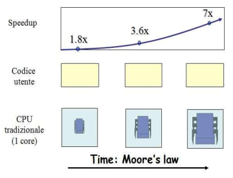
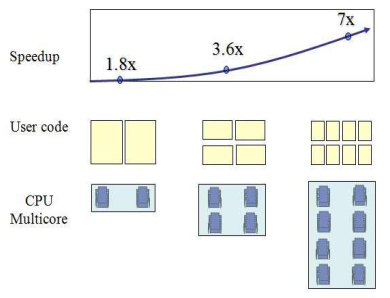
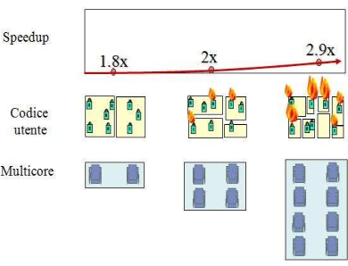
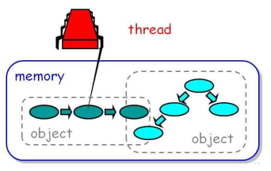
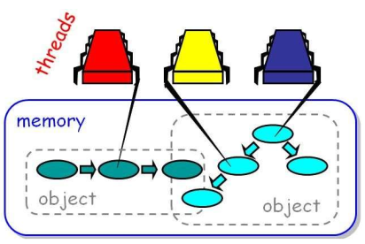

[Lezione4.pdf](/slides/4_TEORIA_4_Thread1_Nuove_AA2425.pdf)

## The Free Performance Lunch
- Non importa quanto veloci diventeranno i processori, i software troveranno nuovi modi di «mangiare» queste prestazioni.
- Il clock speed non è l'unica misura di performance ma è una misura istruttiva.
- Quanto ancora continuerà la crescita?

<br>

- Obiettivo:
    - ridurre lo spessore del package
    - incrementare le prestazioni
    - migliorare le caratteristiche termiche e le capacità di connessione dei chip
- Ma non possiamo avere tutti e 3 contemporaneamente! Vi è l’impossibilità fisica di creare processori sempre più piccoli, se fossero troppo piccoli la carica elettrica non potrebbe essere contenuta nei transistor.


<table>
<tr>
<th> Thermal Noise </th>
<th> Processore single-core </th>
</tr>
<tr>
<td>


I miglioramenti della tecnologia comportavano un automatico miglioramento delle prestazioni. Oggi il miglioramento consiste in più transistor ma organizzati in core multipli che necessitano di software ben sviluppato per sfruttare il parallelismo.

</td>
<td>





</td>
</tr>
</table>

## L'accesso in Memoria
<table>
<tr>
<th> SingleThread </th>
<th> Multicore </th>
</tr>
<tr>
<td>



</td>
<td>



</td>
</tr>
</table>

# Programmazione Distribuita e Concorrente

La programmazione distribuita implica la conoscenza della programmazione concorrente.

- Programmazione concorrente eseguita su calcolatori diversi;
- Processi concorrenti sulla stessa macchina;
- Nello stesso processo;

## Multitasking e MultiThread

**Multitasking**: Il SO crea l’illusione di una macchina completamente dedicata ma durante l’interazione, questa ha l’abilità di servire altri utenti (o processi).

**Multithread**: è l’estensione del multitasking riferita ad un singolo programma attraverso dei sotto-processi “light-weight” che possiedono memoria condivisa.

**Processi e Thread**

Processo:

**Thread**: esistono all’interno di un processo, condividendo tra di loro memoria e file aperti.

In Java ogni applicazione ha almeno un thread utente (’main thread’), più altri di sistema che gestiscono la memoria ed i segnali. Il main thread può creare e far partire diversi altri thread. 

In Java i thread sono oggetti, istanze della classe Thread. Avremo 2 modi di utilizzo:

- Instanziare un thread ogni volta che serve un task asincrono. [Consigliata]
- Astrarre la gestione, passando un task ad un executor.

## Come usare i thread

1. Estendere la classe java.lang.Thread
2. Riscrivere il metodo run() nella sottoclasse di Thread
3. Creare un’istanza di questa classe derivata
4. Richiamare il metodo start() su questa istanza.

<table>
<tr>
<th> Good </th>
<th> Bad </th>
</tr>
<tr>
<td>

```java
public class HelloThread extends Thread {
    // If a class extends Thread
    public void run() {
        System.out.println("Hello from a thread!");
    }

    public static void main(String args[]) {
        // Start a new instance of HelloThread
        (new HelloThread()).start();
    }
}

```

</td>
<td>

**Limitazione**: cosa succede se HelloThread dovesse estendere un’altra classe? Implementiamo l’interfaccia per i Thread.

```java
public class HelloRunnable implements Runnable {
    public void run() {
        System.out.println("Hello from a thread!");
    }

    public static void main(String args[]) {
        (new Thread(new HelloRunnable())).start();
    }
}

```

</td>
</tr>
</table>

## Gli Interrupt

Un interrupt è un’indicazione che un thread dovrebbe fermare quello che sta facendo per fare qualcos’altro. 

Se un thread viene fermato con il metodo sleep(int millisecondi) lancia InterruptException

```java
public class SleepMessages {
    public static void main(String args[]) throws InterruptedException {
        String importantInfo[] = {
            "Mares eat oats",
            "Does eat oats",
            "Little lambs eat ivy",
            "A kid will eat ivy too"
        };
        for (int i = 0; i < importantInfo.length; i++) {
            Thread.sleep(4000);
            System.out.println(importantInfo[i]);
        }
    }
}
```

```java
// altro codice sopra
for (int i = 0; i < importantInfo.length; i++) {
    try {
        Thread.sleep(4000);
    } catch (InterruptedException e) {
        return;   //in questo caso decidiamo di non fare nulla ed uscire
    }
    System.out.println(importantInfo[i]);
}
// altro codice sotto
```

## Il Metodo Join()

A volte è necessario che un thread attenda il completamento di un altro thread. Se **t** è un oggetto il cui thread è in esecuzione, allora:

- Mette il thread corrente in pausa fino a quando il thread t non termina.
- Possibile anche specificare un periodo di attesa come parametro
- Anche join() genera un’eccezione InterruptException

## Esempio SimpleThread

1. Il primo thread è il main thread di un programma Java
    1. e crea un nuovo thread, MessageLoop
2. Aspetta il termine del thread creato
3. Se ci mette troppo, lo interrompe con interrupt() ed attende che termini.

```java
public class SimpleThreads {
    
		static void threadMessage(String msg) {           //metodo scemo per scrivere i messaggi
        String tn = Thread.currentThread().getName();
        System.out.format("%s:%s%n", tn, msg);
    }

    private static class MessageLoop implements Runnable {
        public void run() {                  //definiamo il metodo da eseguire allo start. 
            String impinf[] = {
                "Mares eat oats",
                "Does eat oats",
                "Little lambs eat ivy",
                "A kid will eat ivy too"
            };
            try {
                for (int i = 0; i < impinf.length; i++) {  //fa una pausa di 4 secondi
                    Thread.sleep(4000);
                    threadMessage(impinf[i]);        //poi stampa
                }
            } catch (InterruptedException e) {
                threadMessage("I wasn't done!");     //se interrotta
            }
        }
    }

    public static void main(String args[]) throws InterruptedException {   //lancia un'eccezione
        long patience = 1000 * 60 * 60;

        if (args.length > 0) {
            try {                                             //controllo inutile per vedere se abbiamo inserito un intero
                patience = Long.parseLong(args[0]) * 1000;
            } catch (NumberFormatException e) {
                System.err.println("Argument must be an integer.");
                System.exit(1);
            }
        }

        threadMessage("Starting MessageLoop thread");
        long startTime = System.currentTimeMillis();         //prendiamo il tempo d'inizio
        Thread t = new Thread(new MessageLoop());            //creiamo un oggetto Thread da MessageLoop
        t.start();                                           //lo avviamo
        threadMessage("Waiting for MessageLoop to finish"); 

        while (t.isAlive()) {                   //mentre MessageLoop è in vita
            threadMessage("Still waiting...");  
            t.join(1000);                       //aspetta 1 secondo in più

            if (((System.currentTimeMillis() - startTime) > patience) && t.isAlive()) {   //se la pazienza è scaduta ed è vivo
                threadMessage("Tired of waiting!");
                t.interrupt();          ///interrompiamo il thread 
                t.join();     //aspettiamo la fine delle sue operazioni
            }
        }

        threadMessage("Finally!");  //ed usciamo
    }
}
```

## Comunicazione fra Thread

I thread comunicano condividendo accesso a campi (tipi primitivi) e campi che contengono riferimenti ad oggetti.

Avremo interferenze di thread ed inconsistenza della memoria.

Dobbiamo risolvere i problemi attraverso la **sincronizzazione.** Ovvero, risolvendo i problemi di contesa delle risorse in modo simultaneo.

```java
class Counter {
    private int c = 0;

    public void increment() {
        c++;
    }

    public void decrement() {
        c--;
    }

    public int value() {
        return c;
    }
}
```

## Il Problema di Accesso Concorrente

- Race Condition: il risultato di un’operazione dipende dall’ordine di esecuzione di diversi thread. Gli errori sono tipicamente transienti e difficili da riprodurre (su ogni macchina non è scontata la stessa esecuzione).
- Principio di Heisenberg: “non è possibile misurare simultaneamente la posizione ed il momento di una particella”.

## Errori di Inconsistenza e Happen-Before

Stabilendo una relazione di Happens-Before abbiamo la garanzia che la memoria scritta da un thread è visibile da un altro thread. 

Es: 2 thread. Uno dei 2 incrementa il contatore, il secondo stampa il valore contenuto nella variabile. La modifica del primo thread potrebbe non essere visibile al secondo.

**Esempio di inconsistenza:**
```java
class Foo {
    int bar = 0;

    public static void main(String args[]) {
        (new Foo()).unsafeCall();
    }

    void unsafeCall() {
        final Foo thisObj = this;
        Runnable r = new Runnable() {
            public void run() {
                thisObj.bar = 1;
            }
        };
        Thread t = new Thread(r);
        t.start();
        try {
            Thread.sleep(1000);
        } catch (InterruptedException e) {
            e.printStackTrace();
        }
        System.out.println("bar=" + bar);
    }
}
```

**Come stabilire le relazioni Happens-Before**

- **Thread.start()**: gli effetti del codice che ha condotto alla creazione sono visibili al nuovo thread.
- **Thread.join()**: quando la terminazione di un thread A causa il return della join() di B, tutte le istruzioni di A sono in happens-before delle istruzioni di B che seguono la join.
- Oppure utilizzare una **variabile volatile**. Il valore viene salvato e ricaricato in memoria ad ogni accesso senza utilizzare caching.

Vediamo meglio cosa accade nella pratica.

In questo codice abbiamo 2 thread. Il primo legge il valore di **running** e continua ad incrementare il contatore. Il secondo attende 0,1s e imposta **running** a false. 
Essendo la variabile di tipo volatile, ogni volta che c’è un accesso da parte del primo thread deve necessariamente caricarla dalla memoria, senza cache, pertanto il primo thread si fermerà. Non sarebbe accaduto lo stesso senza variabile volatile!

```java
public class VolatileTest {
    volatile boolean running = true; // nota la parola chiave volatile

    public void test() {
        // lancio un primo Thread
        new Thread(new Runnable() {
            public void run() {
                int counter = 0;
                while (running)
                    counter++;
                System.out.println("Thread 1 concluso. Contatore = " + counter);
            }
        }).start();
        //lancio il secondo thread
        new Thread(new Runnable() {
            public void run() {
                try {
                    Thread.sleep(100);
                    // Questo sleep è necessario per dare al primo thread la possibilità di partire
                } catch (InterruptedException ignored) { }
                System.out.println("Thread 2 concluso");
                running = false;
            }
        }).start();
    }

    public static void main(String[] args) {
        new VolatileTest().test();
    }
}
```

## Relazioni Happens-Before
- Il primo Thread carica in **cache** il valore della variabile booleana __running__ (impostato a true) e non va più a leggere il valore effettivo quando il secondo Thread lo modifica a false.
- Dichiarando **volatile** la variabile __running__ invece si costringe il Thread ad aggiornare di volta in volta il valore senza memorizzarlo in cache.