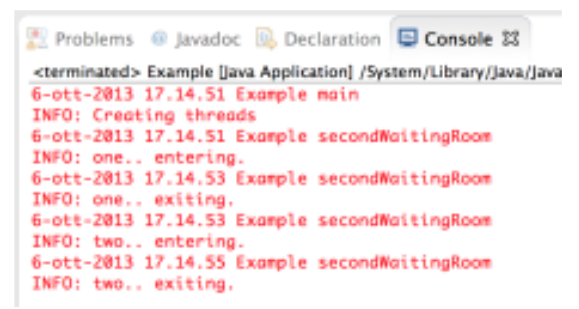
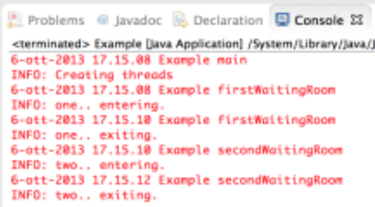
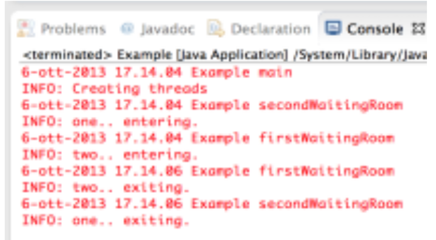

[Lezione6.pdf](/slides/6_TEORIA_4_Thread3_NuoveAA2425.pdf)

## Comprendere la Race Condition
- È necessario comprendere bene in che maniera i metodi synchronized sono
eseguiti in mutua esclusione
- Per questo motivo presentiamo un esempio, semplice, che al variare di alcuni
semplici keyword si comporta in maniera diversa
- Uno strumento di “lavoro” per fare pratica.

<table>
<tr>
</tr>
<tr>
<td>

```java
import java.util.logging.Logger;
public class Example {
	private static Logger log =
		Logger.getLogger("Example");

	public static void main(String[] args) {
		Example ob = new Example();
		log.info("Creating threads");
		SimpleThread one = new SimpleThread("one", ob,2);
		SimpleThread two = new SimpleThread("two", ob,2);
		one.start();
		two.start();
	}

	public synchronized void firstWaitingRoom(
		int sec, String name)
		{ log.info(name+"..entering.");
		try{
			Thread.sleep(sec*1000);
		}catch(InterruptedException e) {
			e.printStackTrace();
		}
			log.info(name+"..exiting.");
	}

	public synchronized void secondWaitingRoom(
		int sec, String name) {
		log.info(name+"..entering.");
		try{
			Thread.sleep(sec*1000);
		}catch(InterruptedException e) {
			e.printStackTrace();
		}
		log.info(name+"..exiting.");
	}
```

</td>
<td>

```java
public class SimpleThread extends Thread {
	private String name;
	private Example object;
	private int delay;

	public SimpleThread(String n,Example obj,int del){
		name = n;
		object = obj;
		delay = del;
	}
	public void run() {
		double y = Math.random();
		int x = (int) (y * 2); // restituisce 1 o 0 in base al valore random
		if(x==0)
			object.firstWaitingRoom(delay, name);
		else//x==1
			object.secondWaitingRoom(delay, name);
	}
}
```

</td>
</tr>
</table>

- Abbiamo 2 thread che cercano di accedere
    - a 2 metodi
    - a volte allo stesso metodo, contemporaneamente.
- I metodi possono essere di istanza o statici.
- I metodi possono essere sincronizzati o non sincronizzati.
- Un metodo può essere invocato da uno solo dei thread od entrambi.

- **Per ogni combinazione si dovrebbe verificare il comportamento e capirlo completamente.**

### Esempio 1
- Supponiamo debbano accedere alla stessa sala d'attesa
- I 2 metodi sono sincronizzati

<table>
<tr>
<th> Good </th>
<th> Bad </th>
</tr>
<tr>
<td>

```java
	public synchronized void firstWaitingRoom(
		int sec, String name)
		{ log.info(name+"..entering.");
		try{
			Thread.sleep(sec*1000);
		}catch(InterruptedException e) {
			e.printStackTrace();
		}
			log.info(name+"..exiting.");
	}

	public synchronized void secondWaitingRoom(
		int sec, String name) {
		log.info(name+"..entering.");
		try{
			Thread.sleep(sec*1000);
		}catch(InterruptedException e) {
			e.printStackTrace();
		}
		log.info(name+"..exiting.");
	}
```

</td>
<td>



</td>
</tr>
</table>

### Esempio 2
- Supponiamo debbano accedere a 2 sale d'attesa diverse
- I 2 metodi sono sincronizzati

<table>
<tr>
<th> Good </th>
<th> Bad </th>
</tr>
<tr>
<td>

```java
	public synchronized void firstWaitingRoom(
		int sec, String name)
		{ log.info(name+"..entering.");
		try{
			Thread.sleep(sec*1000);
		}catch(InterruptedException e) {
			e.printStackTrace();
		}
			log.info(name+"..exiting.");
	}

	public synchronized void secondWaitingRoom(
		int sec, String name) {
		log.info(name+"..entering.");
		try{
			Thread.sleep(sec*1000);
		}catch(InterruptedException e) {
			e.printStackTrace();
		}
		log.info(name+"..exiting.");
	}
```

</td>
<td>



</td>
</tr>
</table>

### Esempio 3
- Supponiamo debbano accedere a 2 sale d'attesa diverse
- Solo 1 metodo è sincronizzato

<table>
<tr>
<th> Good </th>
<th> Bad </th>
</tr>
<tr>
<td>

```java
	public synchronized void firstWaitingRoom(
		int sec, String name)
		{ log.info(name+"..entering.");
		try{
			Thread.sleep(sec*1000);
		}catch(InterruptedException e) {
			e.printStackTrace();
		}
			log.info(name+"..exiting.");
	}

	public void secondWaitingRoom(
		int sec, String name) {
		log.info(name+"..entering.");
		try{
			Thread.sleep(sec*1000);
		}catch(InterruptedException e) {
			e.printStackTrace();
		}
		log.info(name+"..exiting.");
	}
```

</td>
<td>
- non vi è mutua esclusione



</td>
</tr>
</table>

## Comprendere l'efficienza dei Thread
### Inizializzare un array di interi
- Abbiamo un array ""grande"" (10mln di elementi)
- ogni inizializzazione deve avvenire 10000 volte!
```Java
public class ArrayInit extends Thread{
	public static int[] data;
	public static final int SIZE = 10000000; //10 milioni di elementi

	public static void main(String[] args){
		data = new int[SIZE];
		long begin, end;
		int j;
		begin = System.currentTimeMillis();
		for(int i = 0; i < SIZE; i++){
			for(j=0; j < 10000; j++)
				data[i] = i;
			}
		end = System.currentTimeMillis();
		System.out.println("Time:"+ (end - begin) + "ms");
	}//end main
}//end class
```
- Abbiamo eseguito 'a cascata' 10000 volte l'assegnazione.
- Tempo: 2246ms

**idea: Inizializzazione Concorrente**
- Dividiamo invecee l’Array in blocchi, precisamente in SIZE/nThread. Dovremo passare al costruttore la posizione di partenza **start** e quanti elementi vanno inizializzati **dim**. 
- Il thread main attende che tutti terminino con una join().

```Java
public class EffInit extends Thread {
	private int start;
	private int dim;
	public static int[] data;
	public static final int SIZE = 10000000;
	public static final int MAX_THR = 8;
	
	public EffInit(int start, int size){
		this.start = start;
		this.dim = size;
	}

	public void run(){
		int j;
		for(int i = 0; i <this.dim; i++){
			for(j=0; j < 10000; j++)
				data[this.start + i] = i;
			}
	}

	public static void main(String[] args){
		data = new int[SIZE];
		long begin, end;
		int start, j;
		EffInit[] threads;
		for(int numThread = 1; numThread <= MAX_THR; numThread++){
			begin = System.currentTimeMillis();
			start = 0;
			threads = new EffInit[numThread];
			for(j = 0; j < numThread; j++){
				threads[j] = new EffInit(start, SIZE / numThread);
				threads[j].start();
				start += SIZE / numThread;
			}//endfor
			for(j = 0; j < numThread; j++){  //intanto il main attente che terminino
				try{
					threads[j].join();
				}catch(InterruptedException e) {
					e.printStackTrace();
			}
		end = System.currentTimeMillis();
		System.out.println(numThread +"Thread(s): "+ (end - begin) +"ms");
	}
}
```
- È difficile determinare l'efficienza rispetto al metodo classico, in quanto sono presenti I/O Bound, CPU Bound, core reali, buffers, hyperthreading...
	- ma è preferibile questa versione. 


## Il Singleton
- È un Design Pattern della Programmazione ad Oggetti.
- Restringe l'istanziazione da parte di una classe ad 1 oggetto.
- Viene impiegato per le memorizzazioni degli stati: Printer, File, Resource Manager…
- Lazy Allocation: la allocazione avviene solo quando è utilizzato la prima volta.

```Java
class Singleton {
	private static Singleton instance;
	private Singleton() {
	}
		public static Singleton getInstance() {
			if(instance == null) { //se non è stato creato
				instance = new Singleton(); //crealo
			}
			return instance; //restituiscilo
		}
}
```
Se sono presenti più Thread dobbiamo usare **synchronized**

```Java
class Singleton {
	private static Singleton instance;
	private Singleton() {
	}
		public static Singleton getInstance() {
			if(instance == null) { //se non è stato creato
				instance = new Singleton(); //crealo
			}
			return instance; //restituiscilo
		}
}
```

- **Cosa accade se avessimo più thread e chiamassi la classe Singleton quando ancora deve essere creata l'istanza?**
	- Interleaving! più singleton generati col codice sopra!
	- Vediamo l'approccio qui sotto...

```Java
class Singleton {
	private static Singleton instance;
	private Singleton() {
	}
		public static synchronized Singleton getInstance() { // aggiungiamo synchronized
			if(instance == null) { //se non è stato creato
				instance = new Singleton(); //crealo
			}
			return instance; //restituiscilo
		}
}
```
### **Problema: efficienza**
- Le performance del codice sopra però non sono delle migliori. Anche se ora funziona.
- Eliminiamo l’invocazione sincronizzata del metodo e rendiamo sincronizzata solo la creazione del nuovo singleton.
	- NON VA BENE! Se A e B entrano insieme nella sezione critica, prima A restituisce il primo singleton, poi B entra e ne crea uno nuovo, sovrascrivendolo. Dobbiamo effettuare ancora un ulteriore controllo **e non è garantito che funzioni!**
	- Il codice d'esempio della procedura descritta è fornito qui sotto.

```Java
class Singleton {
	private static Singleton instance;
	private Singleton() {
	}
		public static Singleton getInstance() {
			if(instance == null) { //se non è stato creato
				synchronized(Singleton.class) {
					if(instance == null) //controlliamo che la situazione non sia cambiata
						instance = new Singleton(); //crealo	
				}				
			}
			return instance; //restituiscilo
		}
}
```
### Soluzione Definitiva “Initialization-on-Demand Holder”
- Instance deve essere volatile. 
- LazyHolder è inizializzata dalla JVM solo quando serve (alla prima getInstance()).
- Essendo un inizializzatore statico, viene eseguito una sola volta (al caricamento) e stabilisce una relazione happens-before tutte le altre operazioni sulla classe

<table>
<tr>
<th> Esempio LazyHolder </th>
<th> Applicato al Singleton </th>
</tr>
<tr>
<td>

```java
public class Something {
	
	private Something() {}
	
	private static class LazyHolder {
		private static final Something INSTANCE = new Something();
	}

	public static Something getInstance() {
		return LazyHolder.INSTANCE;
	}
}
```

</td>
<td>

```java
public class Singleton {
    // Private constructor to prevent external instantiation
    private Singleton() {}

    private static class SingletonHolder {
        // Initialize the Singleton instance when the class is loaded
        private static final Singleton INSTANCE = new Singleton();
    }

    public static Singleton getInstance() {
        return SingletonHolder.INSTANCE;
    }
}
```

</td>
</tr>
</table>