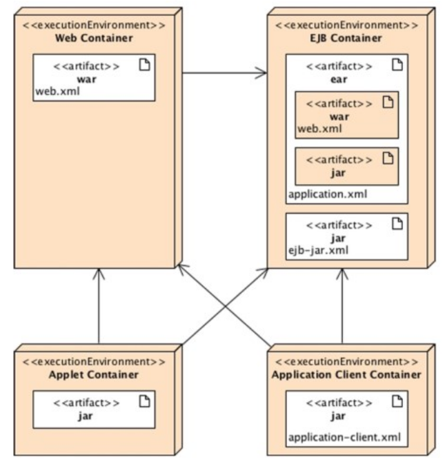

[Lezione7.pdf](/slides/7_1_IntroduzioneJEE_Nuove_AA2425.pdf)

## Perché Java Enterprise

È un insieme di specifiche progettate per applicazioni Enterprise

- Facilita lo sviluppo di applicazioni distribuite, robuste, powerful, altamente distribuite!
    - Non si implementano strutture dati da 0 ma si utilizza ciò che le librerie forniscono. Collections di Java SE, Java Transaction API, Java Message Service, Java Persistence API…
- Le imprese hanno necessità di applicazioni software complesse, distribuite.
    - Eseguono business 24/7, diversi datacenter, sistemi internazionalizzati, time-zone diverse…
    - Riduzione dei costi
    - Riduzione dei tempi di risposta dei servizi
    - Storing dei dati in maniera affidabile e sicura
    - Fornire interfacce web per i clienti, fornitori ed impiegati
    
    - Combinare queste specifiche con gli Enterprise Information Systems preesistenti di tali aziende.
    - Sviluppare applicazioni B2B per comunicazione con partners o applicazioni B2C usando applicazioni mobile o geolocalizzate
    - Coordinare in-house data, memorizzati in differenti locazioni, processati da diversi linguaggi, instradati attraverso protocolli diversi.
    - Evitare System Crash, garantire disponibilità, scalabilità, sicurezza.

    ### Enterprise Computing

- Più efficienza con meno risorse e minori investimenti, garantendo alta disponibilità, scalabilità, sicurezza.
    - in quanto Java EE implementa numerose funzionalità, lasciando al programmatore solo il compito di sfruttarle per completare le sue features di business.
- Riduzione del tempo di sviluppo e complessità delle applicazioni.
- Aumento della Application Performance.

#### Architettura Multilayer

- La logica dell’applicazione è separata in componenti.
- Componenti in diversi layer, mappati su diversi Tier in un ambiente Java EE.
- Classico mapping 3-tier: client, server EE, Database

### Architettura

- Java EE Infrastructure è partizionata in domini logici chiamati container
    - ogni container ha uno specifico ruolo
    - ogni container ha un set di API
    - ogni container offre servizi alle componenti (security, db access, transaction handling, naming directory…)
    - **nascondono complessi dettagli tecnici e migliorano la portabilità.**

    

    - a seconda dell’applicazione che si vuole costruire, bisogna capire funzionalità e limiti di ogni container:
    - Se si vuole costruire una Web Application, svilupperemo un JSF tier con EJB Lite Tier e fare il Deploy in un Web Container
    - Se si vuole una Web Application che invochi un business tier da remoto e usare asynchronous messaging c’è necessità sia di Web che EJB container.
    - **Metteremo molto mano sull’EJB Container.**

## Componenti di Java EE

- **Client Components (Java EE Clients)**
    - Web Clients
        - Applicazioni eseguite su Web Browser, pagine dinamiche HTML, XML, etc
        - Possono contenere Applets: piccole app eseguite in locale dal Client
        - È un **Thin Client** se non effettua query a database, non possiede logica di business e non ha connessioni a legacy applications.
    - Application Clients
        - Programmi eseguiti sul client
        - Interfaccia Utente ricca
        - GUI creata con Toolkit Java (Swing…)
        - Accesso diretto allo strato business
        - Possibile il passaggio via strato Web (HTTP)
    - Applets
- **Web Components**
    - Applicazioni eseguite in un web container che rispondono a richieste HTTP da web client
    - Servlet o pagine create con Server Faces / Java Server Pages
    - Può includere JavaBeans
        - **servlet**: classi dinamiche che processano richieste e costruiscono risposte
        - **JSP**: text-based documents che eseguono servlet
        - **JavaServer Faces**: fornisce pagine dinamiche sfruttando JSP e Servlet
- **Business Components**
    - Eseguite in un EJB container
        - sono container-managed components per logica di business transazionale.
    - Enterprise Java Beans, Java Message Service, Java Transaction API, asynchronous calls, RMI/IIOP
    - Possono essere acceduti localmente o da remoto attraverso RMI, HTTP per SOAP o RESTful Web Service

## Java EE Container
Java EE fornisce servizi sotto forma di container. Lo sviluppatore non deve svilupparli e può concentrarsi sulla logica di business. 

1. Rappresentano l’interfaccia tra una componente e le funzionalità a basso livello che supporta la componente.
2. Prima di essere eseguita, una Componente deve essere assemblata in una Java EE module e deployata nel suo container.
3. Questo packaging specifica per ogni componente i settaggi del container.
- **Applet Container**
    - Fornito dalla maggior parte dei browser per eseguire applet components.
    - Sicurezza fornita da sandbox (accesso limitato alla macchina client)
    - Impedisce accesso al computer locale per accesso a processi o files.
- **Application Client Container (ACC)**
    - Insieme di classi Java, Librerie… che permette di usare servizi Java EE in applicazioni SE
    - Servizi come sicurezza, naming acceduti da applicazione standard (con un main())
    - Comunica con l’EJB container usando RMI-IIOP e con il Web Container usando HTTP
- **Web Container**
    - Servizi per la gestione ed esecuzione di componenti web
    - Servlet, JSPs, filtri, listeners, pagine JSF, web services.
    - Responsabile per inizializzazione, invocazione e gestione del ciclo di vita delle servlet
- **EJB Container**
    - Responsabile della gestione dei bean
    - Business Logic Layer
    - Gestisce il ciclo di vita degli EJB
    - Fornisce transazioni, sicurezza, concorrenza, distribuzione, servizio di naming, invocazioni asincrone

### Servizi Importanti

- Java Transaction API
- **Java Persistence API**: standardi API per object-relational mapping (ORM) con linguaggio Java Persistence Query Language (JPQL) si possono fare query su oggetti.
- **Java Message Service**: comunicazione asincrona tra le componenti
- Servizi di Sicurezza: Java Authentication and Authorization Service (JAAS)
- Web Services: Java API for XML Web Services (JAX-WS) e Java API for RESTful Web Services (JAX-RS)
- Dependency Injection: risorse possono essere iniettate nelle componenti ‘managed’

## Packaging

- Prima di effettuare il deploy in un container, le componenti devono essere formattate in un archivio Standard
- Java SE definisce un archivio Java Archive (JAR) usato per aggregare diversi tipi di files in un file compresso
- Java EE definisce differenti tipi di moduli con il proprio packaging format, basato sul proprio jar format.

**Packaging per Application Client Module**

- Contiene classi Java e altre risorse packaged in un file JAR
- il jar può essere eseguito in una Java SE o Application Client Container.
- Il JAR contiene la directory META-INF con meta information per la descrizione dell’archivio in MANIFEST.MF
- Se <<deployato>> in un ACC, il deployment descriptor si troverà nel file META-INF/application-client.xml

**Packaging per Modulo EJB**

- Contiene uno o più session o Message-Driven beans (MDBs) impacchettati in un JAR
- Deployment Descriptor in META-INF/ejb-jar.xml

**Packaging per Modulo Web Application** 

- Contiene servlet, JSP, HTML, CSS, JS…
- JAR file con estensione .WAR
- Deployment Descriptor in WEB-INF/web.xml
- Se il war contiene un EJB lite beans il deployment descriptor è settato in WEB-INF/ejb-jar
- Le classi in WEB-INF/classes e altri jar in WEB-INF/lib

**Packaging per Enterprise Module**

- Include moduli EJB e moduli Web Applications e altre librerie esterne
- Archivio JAR con estensione .EAR
- Permette il Deployment coerente in un unico passo
- Deployment Descriptor in META-INF/application.xml

## Deployment Descriptor ed Annotazioni

- In un Programming Paradigm esistono 2 approcci:
    - Imperative Programming
        - Specifica l’algoritmo per raggiungere un obiettivo
    - Declarative Programming
        - Specifica come raggiungere questo obiettivo
- In Java EE il declarative programming è realizzato attraverso l’uso di metadata, Annotations e/o Deployment Descriptors

- Le componenti sono eseguite in un container ed ogni container offre un insieme di servizi.
- **I metadati sono usati per dichiarare e personalizzare i servizi.**
- Il tutto avviene mediante annotazioni tipo keyword: @xxx
    - Permettono ad un *Plain Old Java Object* di diventare una componente
- Altri meccanismi sono quelli di dichiarare un deployment descriptor scritto in XML (come il pom.xml)

<table>
<tr>
<th> EJB con Annotazioni </th>
<th> Deployment Descriptor equivalente </th>
</tr>
<tr>
<td>

</td>
<td>

</td>
</tr>
</table>

### Differenze
- La maggior parte dei deployment descriptor sono OPZIONALI e si possono usare le annotazioni.
- Le annotazioni riducono la quantità di codice da scrivere (meno file)
- Il vantaggio dei deployment descriptor è che possono essere modificati senza richiedere modifiche al codice sorgente e ricompilazioni.
- Se esistono entrambi, XML ha la precedenza sulle annotazioni.
- Il meccanismo preferito è l’annotazione

# **Materiale Non Richiesto Per l'Esame**

## L’importanza degli standard

- Java EE fornisce un ambiente open (no vendor lock-in) con diversi server commerciali (WebLogic, Websphere, MQSeries, etc) e open source (GlassFish, JBoss, Hibernate, Open JPA, Jersey…) per gestire transazioni, security, persistenza etc..
- Oggi le applicazioni possono essere deployate in un qualunque application server con pochi cambiamenti.

## Java Community Process

Sun dal 1998 ha definito un’organizzazione coinvolat per la definizione di versioni e caratteristiche future di Java.

Quando vi è la necessità, viene creata una Java Specification Request (JSR) con un gruppo di esperti rappresentanti di aziende, organizzazioni, università, individui singoli. La JSR sviluppa le specifiche, una Reference Implementation e un Compatibility Test Kit.

L’approvazione avviene da parte dell’Executive Committee di JCP

- Initialization
    - L’idea iniziale è sottoposta al JCP da un membro come richiesta di modifica, aggiornamento o creazione di una nuova specifica. (la JSR)
    - Nelle 2 settimane successive dalla richiesta, pubblico, membri ed esperti hanno la possibilità di rivederla, commentarla e darle la forma definitiva. Al termine di questo periodo, verrà sottoposta alla votazione del Comitato Esecutivo (EC).
    - Se la proposta passa positivamente la votazione, la richiesta va avanti nel suo iter e procede.
- Early Draft
    - Si fornisce una prima bozza della futura JSR nei 2-3 mesi successivi. Il capo lavora con un gruppo di esperti che si preoccupano di scrivere la bozza della specifica. La bozza viene presentata e sottoposta a revisione da altri esperti, membri e pubblico per ricevere commenti ed aggiornarne i contenuti.
- Public Draft
    - Quando la bozza è terminata, si procede allo sviluppo dettagliato della JSR per altri 1 o 3 mesi con la preparazione di una bozza pubblica. Questa verrà sottoposta nuovamente al Comitato Esecutivo che ne vaglia la correttezza e complessità.
    - Se la votazione è positiva, si procede alla Bozza Finale ed il capo progetto prepara un prototipo che esplicitamente fa riferimento all’implementazione.
    - Il capo progetto deve preparare il Kit di Compatibilità tecnologica (TCK). Al termine, tutta questa documentazione passa al vaglio del Comitato Esecutivo che può approvare o meno la sua pubblicazione sotto forma di ‘Versione Finale’. In caso di votazione positiva, il gruppo di esperti della JSR si scioglie e la proposta diventa standard a tutti gli effetti
- Maintenance
    - Se sono necessarie modifiche, il capo progetto può distribuire aggiornamenti di manutenzione. Esperti, membri e pubblico partecipano a contribuire alla stesura dell’aggiornamento che viene passato in votazione al Comitato Esecutivo. o scopo è quello di approvare l’inclusione della JSR come aggiornamento minore.