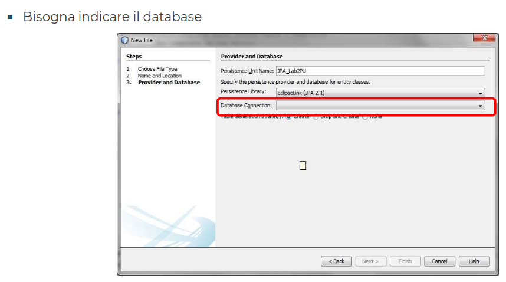
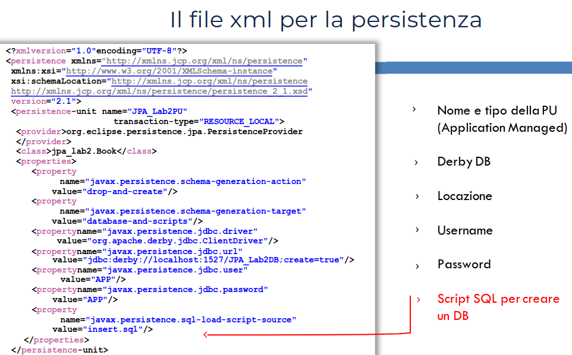
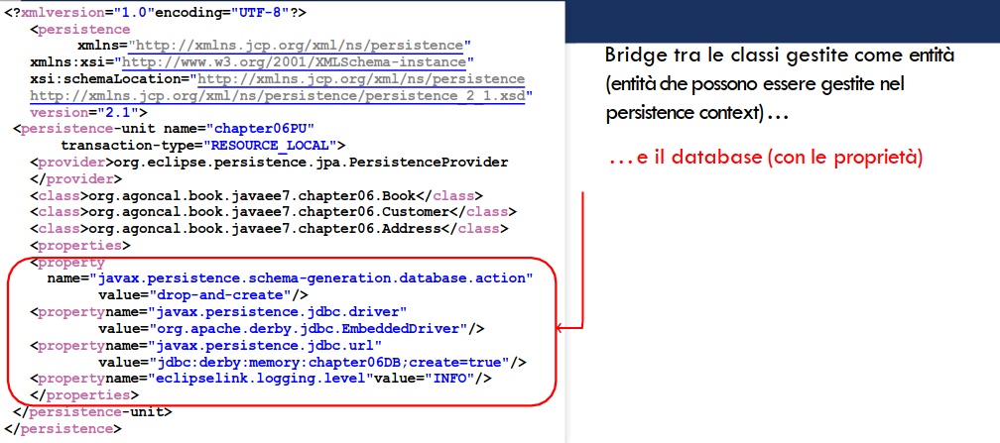

[Lezione9.pdf](/slides/9_JPA_1_NuoveAA2425.pdf)

# Java Persistence API

## Introduzione
- Le applicazioni sono fatte di logica, interazioni con altri sistemi, user interfaces, etc...
    - ma anche di dati
- I DB assicurano la persistenza dei dati
- I dati sono di solito memorizzati (in DB) reperiti ed analizzati
    - tabelle, righe, colonne, chiavi primarie, indici, join...
- ... vocabolario completamente diverso da quello dei linguaggi di programmazione OO
    - classi, variabili, riferimenti, metodi, attributi...
<br><br>
- la differenza: **la persistenza**
    - quando il Garbage Collector decide di eliminare un elemento, è perso per sempre!.
    - i database sono invece persistenti.
    - L'Object-Relational Mapping mette insieme i 2 mondi

## Specifiche di JPA
- Creato con Java EE 5 per portare il modello OO e i DB
- JPA è un'astrazione su JDBC che lo rende indipendente da SQL
- Contenuto nel package javax.persistence
- Definisce l'Object-Relational Mapping
- Possiamo interrogare il DB con il linguaggio Java Persistence Query Language.

### Cos'è un'entità
- **un oggetto** è un'istanza di una classe che risiede in memoria e ha vita breve
- **un'entità** è persistentemente in un database.
    - in POJO è una classe particolare annotata con @javax.persistence.Entity
        - con un costruttore senza argomenti (public o protected). Può possedere altri costruttori.
        - usata come una normale classe Java.
        - non è Final, così come gli attributi.
        - se deve essere passata per valore deve implementare Serializable.
    - Obiettivo: rendere le entità persistenti, crearle, rimuoverle ed eseguire query.


<table>
<tr>
<th> Codice </th>
<th> Spiegazione </th>
</tr>
<tr>
<td>

```Java
@Entity
public class Book {
    @Id @GeneratedValue
    private Long id;
    private String title;
    private Float price;
    private String description;
    private String isbn;

    //...
}
```

</td>
<td>

- L'entità è annotata con @javax.persistence.Entity
- @javax.persistence.Entity.id definisce l'ID univoca dell'oggetto.
    - in questo modo il persistence provider la considera come una classe persistente e non come un POJO
    - coincide con la chiave primaria

</td>
</tr>
</table>


- Come fa questa classe ad essere mappata in una tabella?
    - Grazie alle annotazioni.

## Ruolo dei metadati in ORM
- Il principio di ORM è quello di delegare a tools esterni o frameworks (nel nostro caso
JPA) il compito di creare una corrispondenza fra oggetti e tabelle
    - come fa JPA a mappare oggetti in un database?
        - attraverso i metadati
            - Annotazioni
            - Descrittori XML
- **Configuration By Exception**: importante tecnica in cui le regole di default vengono applicate dal container, se non altrimenti specificate.
- Anche conosciuta come **convention over configuration**
- Fornire una configurazione (personalizzazione) rappresenta un'eccezione alla regola.
- Con questa tecnica, il POJO di Book diventa:


<table>
<tr>
<th> Spiegazione </th>
<th> Relazione </th>
</tr>
<tr>
<td>

- Nome dell'entità diventa nome della tabella
- Nome degli attributi diventano il nome delle colonne
- Mapping primitive Java a tipi di dati relazionali: String a Varchar, Long a BIGINT...
- Informazioni fornite in persistence.xml
- Segue il principio del Configuration By Exception

</td>
<td>


</td>
</tr>
</table>

- Senza annotazioni, **Book** verrebbe trattato come un POJO e non come classe persistente.
- La regola è:
    - se nessuna speciale configurazione viene indicata, il comportamento di default viene applicato.
- Cambiare questo comportamento significa annotare la classe con @Entity
- Lo stesso vale per l'Identifier: è necessario un modo per dire al Persistence Provider che l'attributo **id** deve essere mappato in una Primary Key
- Annotando con @Id ed aggiungendo @GeneratedValue l'identifier verrà automaticamente generato dal Persistence Provider.
```sql
CREATE TABLE Book (
    ID BIGINT NOT NULL,
    TITLE VARCHAR(255),
    PRICE FLOAT,
    DESCRIPTION VARCHAR(255),
    ISBN VARCHAR(255),
    NBOFPAGE INTEGER,
    ILLUSTRATIONS SMALLINT DEFAULT 0,
    PRIMARY KEY (ID)
)
```
### mapping di Book

## Come fare le Query di Entità
- JPA permette di assegnare entità a DB e di fare query su di loro.
    - sfruttando il linguaggio Java (non SQL)
- Per orchestrare il tutto serve un EntityManager per le operazioni CRUD.

```Java
EntityManagerFactory emf = Persistence.createEntityManagerFactory("chapter04PU")

EntityManager em = emf.createEntityManager();

em.persist(book);
```

## Ruolo di EntityManager
- Interagisce con l'entità e con il database sottostante


### Esempio di Query
- L'EntityManager permette di fare query
- In questo caso una query è simile ad un database query ma viene eseguita usando JPQL e non solo SQL
- Es: tutti i libri col titolo H2G2

SELECT b FROM Book b WHERE b.title = 'H2G2'
- title è un attributo di classe, non un nome di tabella
- JPQL statements manipolano oggetti ed attributi. Non Tabelle e Colonne.
- Un'istruzione JPQL può essere eseguita:
    - con query dinamiche (a runtime)
    - con query statiche (definite staticamente a tempo di compilazione)
    - nativamente con native SQL o __stored procedures__

### Esempio di Named Query
```Java
@Entity
@NamedQuery(
    name ="findBookH2G2", //nome della query
    query ="SELECT b FROM Book b WHERE b.title = ’H2G2’" //cosa fa la query
)
public class Book { //creo una classe specchio di un record dalla tabella di interesse
    @Id @GeneratedValue
    private Long id;
    private String title;
    private Float price;
    private String description;
    private String isbn;
    private Integer nbOfPage;
    private Boolean illustrations;
//Constructors,getters,setters
}

public class Main {
    public static void main(String[] args)
    {
    Book book = new Book("H2G2", 12.5F,"The Hitchhiker’s Guide to the Galaxy", "1-84023-742-2", 354, false);
    EntityManagerFactory emf = Persistence createEntityManagerFactory("chapter04PU");
    EntityManager em = emf.createEntityManager();
    EntityTransaction tx = em.getTransaction();
    tx.begin();
    em.persist(book);
    tx.commit();
    book = em.createNamedQuery("findBookH2G2",
    Book.class).getSingleResult();
    em.close();
    emf.close();
    }
}
```

## Persistence Unit
- Come si chiama il Database? Che driver JDBC deve essere usato? Come si connette al Database?
- Main class crea un EntityManagerFactory, gli passiamo il nome di una Persistence Unit come parametro: 'chapter04PU'.
- Il Persistence Unit indica all'EM il tipo di database da usare, ed i connection parameters, definiti nel file XML: **persistence.xml**

### Persistence Unit
- Possiamo inserire:
    - Nome (con coi è chiamata la PU)
    - Classe a cui si riferisce (l'entità)
    - Tipo di Database (per il giusto JDBC)
    - La posizione (URL)
    - Modalità di autenticazione
- Senza queste specifiche, un POJO può essere usato 'semplicemente' come una classe per istanze di oggetti Java tradizionali.
- (di nuovo, tu ripet)Senza Persistence Unit le entità possono essere manipolate esclusivamente come POJO senza funzionalità di persistenza.

## Ciclo di Vita delle Entità


- Si crea un'istanza di un'entity Book con l'operatore **new**, l'oggetto esiste in memoria e JPA non sa niente di lui.
- Quando diventa "Managed" dall'entity manager, la tabella BOOK mappa e sincronizza il suo stato.
- Chiamare il metodo EntityManager.remove() cancella i dati nel database, ma gli oggetti Java continuano a rimanere in memoria fino all'intervento del Garbage Collector.
- Le operazioni sono:
    - persisting, updating, removing e loading. **OVVERO**:
    - inserting, updating, deleting e selecting (su db)

## JPA Specification Overview
- JPA è un’astrazione di JDBC e permette indipendenza da SQL.
- Tutte le classi e le annotazioni sono contenute nel package javax.persistence
<br><br>
- Le principali componenti di JPA sono:
    - Object-Relational Mapping (ORM): meccanismo che permette di mappare oggetti in dati
memorizzati in un database
    - Entity manager API: per eseguire database-related operations (CRUD)
    - Java Persistence Query Language (JPQL): permette di recuperare dati con un object-oriented
query language
    - Transaction e Looking mechanisms che Java Transaction API (JTA) fornisce per gestire l’accesso
concorrente ai dati
        - JPA supporta anche resource-local (non-JTA) transactions
    - Callbacks e listeners: per agganciare (to hook) business logic nel ciclo di vita di un oggetto
persistente

## Putting It All Together [Esempio]
- Vogliamo creare un Entity Book e scrivere una piccola applicazione che memorizza l'entità in un Database


```Java
@Entity
@NamedQueries({
    @NamedQuery(name ="findAllBooks",
    query ="SELECT b FROM Book b"),
    @NamedQuery(name ="findBookH2G2",
    query ="SELECT b FROM Book b WHERE b.title = ’H2G2’")
})
public class Book {
@Id @GeneratedValue private
Long id;
private String title;
private Float price;
private String description;
private String isbn;
private Integer nbOfPage;
private Boolean illustrations;
//Constructors,getters,setters

```








```Java
package org.agoncal.book.javaee7.chapter04;
public class Main {
    public static void main(String[] args) {
        // crea un'istanza di un libro
        Book book = new Book("H2G2", 12.5F, "The Hitchhiker’s Guide to the Galaxy", "1-84023-742-2", 354, false);
        
        // ottiene l'entity manager e transazione
        EntityManagerFactory emf = Persistence.createEntityManagerFactory("chapter04PU");
        EntityManager em = emf.createEntityManager();
        
        // rendi persistente il libro al database
        EntityTransaction tx = em.getTransaction();
        tx.begin();
        em.persist(book);
        tx.commit();
        
        // esegui la named-query per H2G2
        book = em.createNamedQuery('findBookH2G2', Book.class).getSingleResult();
        System.out.println("Query per H2G2")
        System.out.println("######### " + book.getDescription());
        
        // esegui la query su tutti i libri nel database
        Query all = em.createNamedQuery("findAllBooks", Book.class);
        List<Book> result = all.getResultList();
        System.out.println("Query per tutti i libri")
        for (Book b : results) {
            System.out.println(b.getTitle());
        }
        
        // chiudi l'entity manager e factory
        em.close();
        emf.close();
    }
}
```


## Caratteristiche dell'Entity Manager
- Punto centrale di JPA
- Gestisce stato e ciclo di vita delle Entità
- Fa query di entità all'interno di un persistence control
- Tra le altre cose, protegge da accessi concorrenti utilizzante tecniche di locking
<br><br>
- quando un Entity Manager ottiene un riferimento ad un'entità viene detto **'managed'**
    - altrimenti l'entità è vista come un POJO
- la potenza di JPA è che le entità possono essere usate come oggetti regolari da differenti layer di un'applicazione e diventare 'managed' dall'entity manager quando bisogna caricare o inserire dati in un database.
    - da 'managed' possiamo eseguire persistence operations e l'entity manager automaticamente sincronizzerà lo stato dell'Entity col Database
    - Quando l'entity è 'detached' ritorna ad essere un POJO e può essere usato da altri layers, senza persistenza.

### Come si ottiene un Entity Manager
- L'Entity Manager rappresenta l'interfaccia principale per interagire con le entità, ma prima deve essere ottenuta dall'applicazione.
- Il codice cambia a seconda che l'ambiente sia:
    - Application Managed
        - L'applicazione è responsabile per l'istanza specifica di Entity Manager e per gestirne il ciclo di vita.
    - Container Managed
        - L'applicazione è una servlet o un Enterprise Java Bean e ci si affida a risorse iniettate.
        - Le transazioni sono gestite dal container
        - Non scriviamo commit o rollback, necessari invece per Applcation Managed environments.


## Il Persistence Context
- È un insieme di istanze di entità gestite in un certo tempo per una certa transazione utente.
    - Solo un'entità con la stessa ID può esistere in un persistence context.
        - se un libro con ID 12 esiste nel persistence context, non potrà esistere nessun altro libro con lo stesso ID.
- L'EM aggiorna o consulta il persistence context quando viene chiamato un metodo dell'interfaccia javax.persistence.EntityManager.
    - ES: quando il metodo persist() viene invocato l'entità passata come argomento verrà aggiunta al persistence context (se non esiste già)
    - Quando si cerca un'entità per Primary Key, l'EM controla che l'entità richiesta non sia nel persistence context.
- Una sorta di first-level cache: spazio dove l'entity manager memorizza entità prima della scrittura (flush()) nel database.
<br><br>
- Ogni utente ha il suo Persistence Context. Ha vita breve, rappresenta la durata di una transazione.
    - Esempio: 2 utenti hanno necessità di accedere all'entità i cui dati sono memorizzati in un database.
        - ogni utente ha il suo persistence context che ha vista per la durata della sua transazione.


## PU come Bridge fra Context e DB



