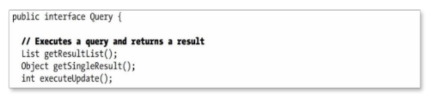
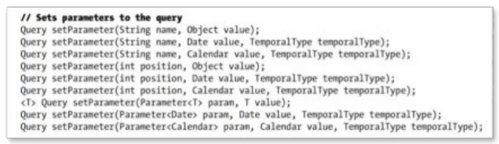
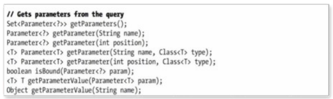
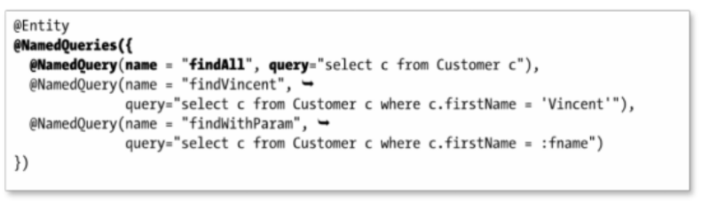
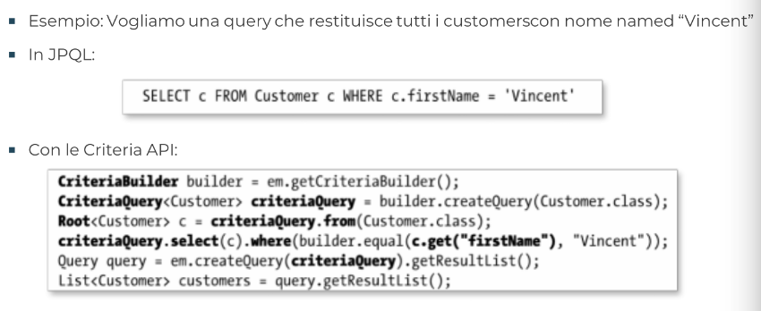
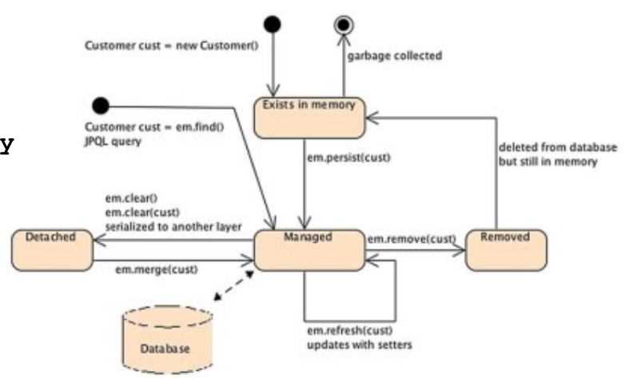

[Lezione9.pdf](/slides/9_JPA_2_NuoveAA2425.pdf)

## Query Possibili con JPA
- Ci sono 5 tipi di query che permettono in diversi contesti di integrare JPQL nelle applicazioni Java:
    - Query Dinamiche: specificate a run-time (costose in termini di prestazioni)
    - Named Query: statiche, definite e non modificabili
    - Criteria API: un nuovo tipo di query object-oriented (>JPA 2.0)
    - Query Native: per eseguire SQL nativo invece di JPQL
-Tramite metodi dell'Entity Manager si ottiene una query di un certo tipo, dalla quale si vanno a prelevare risultato/risultati ecc.

### Query API
- Eseguire una query ed ottenere risultati

- Settare parametri per una query

- Ottenere parametri da una query


## Query Dinamiche
- Restituito un oggetto Query.
- Il risultato della query è una lista
- Il metodo getResultList() method restituisce una lista di Customer entities (List<Customer>)
    - restituisce una lista di untyped objects.
    ```Java
    Query query = em.createQuery("SELECT c FROM Customer c");
    List<Customer> customers = query.getResultList();
    ```
- Se invece vogliamo l'effetto paginazione:
    ```Java
    Query query = em.createQuery("SELECT c FROM Customer c");
    query.setMaxResults(10);
    List<Customer> customers = query.getResultList();
    ```

## Named Queries
- Sono statiche e non modificabili
- Meno flessibili ma più efficienti, dal momento che il persistence provider può tradurre la stringa JPQL in SQL una sola volta quando l'applicazione parte, e non ogni volta che la query deve essere eseguita.
- Si usa l'annotazione '@NamedQuery'
- Esempio: cambiamo l'entità **Customer** e staticamente definiamo 3 queries usando l'annotazione richiesta.

```Java
@Entity
@NamedQueries({
@NamedQuery(name = "findAll", query="select c from Customer c"),
@NamedQuery(name = "findVincent",
query="select c from Customer c where c.firstName = ’Vincent’"),
@NamedQuery(name = "findWithParam",
query="select c from Customer c where c.firstName = :fname")
})
public class Customer {
@Id @GeneratedValue
    private Long id;
    private String firstName;
    private String lastName;
    private Integer age;
    private String email;
    @OneToOne
    @JoinColumn(name = "address_fk")
    private Address address;

// Constructors, getters, setters
```
- Utilizzo:
```Java
Query query = em.createNamedQuery('findWithParam');
query.setParameter('fname', 'Vincent');
query.setMaxResults(3);
List<Customer> customers = query.getResultList();

// possiamo fare anche una cosa più fina, come:
Query query = em.createNamedQuery("findWithParam").setParameter("fname","Vincent").setMaxResults(3);
```
- Attenzione:
    - Essendo stringhe i parametri inseriti, eventuali errori dell'esecuzione delle query vengono riconosciuti a runtime
    - Ogni query deve possedere un nome univoco.

## Criteria API (aka Object-Oriented-Queries)
- Il vantaggio di scrivere concisamente le stringhe, è accoppiato al problema della mancanza di controlli a tempo di compilazione.
Errori come SLECT invece di SELECT sono scoperti a runtime.
- Da JPA 2.0 ci sono le Criteria API, permettono di scrivere le query in maniera sintatticamente corretta.
- L'idea è che tutte le keywords JPQL sono definite da questa API.
    - supporta tutto quello che può fare JPQL ma in maniera Object-Oriented.
    
- SELECT, FROM, WHERE hanno un API representation attraverso i metodi: select() from() e where()

## Native Queries
- Prendono una native SQL statement (SELECT, UPDATE, DELETE...)
- NON sono portabili.
```Java
Query query = em.createNativeQuery('Select * FROM t_customer', Customer.class);
List<Customer> customers = query.getResultList();
```
- Esistono anche le Named **Native** Queries, definite usando l'annotazione @NamedNativeQuery
- Usa le stesse regole delle classiche Native Queries.
```Java
@Entity
@NamedNativeQuery(name = 'findAll', query = 'select * from t_customer')
@Table(name = 't_customer')
public class Customer {
    //...
}
```

## Stored Procedure
- Tutte le query finora viste sono simili in comportamento
- Le query stores sono invece esse stesse definite nel database
- Utili per compiti ripetitivi ed ad alta intensità di uso dei dati.
- Diversi vantaggi (anche se si perde di portabilità):
    - migliori prestazioni per la precompilazione
    permette di raccogliere statistiche, per ottimizzare le prestazioni
    - evita di dover trasmettere dati (codice dal server)
    - codice centralizzato e usabile da diversi programmi (non solo java)
    - ulteriore possibilità di controlli di sicurezza (accesso alla stored procedure)

### Esempio pratico
- Servizio di archiviazione di libri e CD:
    - dopo una certa data, books e CDs devono essere archiviati.
        - fisicamente trasferiti dal magazzino al rivenditore
    - il servizio è time consuming e diverse tabelle vanno aggiornate.
        - inventory, warehouse, book, CD, transportation table...
    Soluzione: scriviamo una stored-procedure che ragrgruppi diverse istruzioni SQL per migliorare le performance.
- La stored procedure **sp_archive_books**
    - ha 2 argomenti in ingresso: __archive date__ ed un __warehouse code__
    - aggiorna le tabelle **T_inventory** e **T_transport**

<table>
<tr>
<th> Procedura in SQL </th>
<th> Bad </th>
</tr>
<tr>
<td>

```SQL
CREATE PROCEDURE sp_archive_books @archiveDate DATE, @warehouseCode VARCHAR AS UPDATE T_Inventory
SET Number_Of_Books_Left -1
WHERE Archive_Date < @archiveDate AND Warehouse_Code = @warehouseCode;

UPDATE T_Transport
SET Warehouse_To_Take_Books_From = @warehouseCode;
END

```

</td>
<td>

- La stored procedure è compilata nel database e può essere invocata attraverso il suo nome **sp_archive_books**
- La stored procedure accetta dati nella forma di parametri di input e di output (@archiveDate e @warehouseCode nel nostro esempio)

</td>
</tr>
</table>

## Ciclo di vita di un'entità

- Per creare un'istanza della Customer entity, usiamo l'operatore **new**
- Questo oggetto esiste in memoria anche se JPA non ne è ancora a conoscenza.
- Se l'oggetto non viene usato, verrà liberato dal garbage collector ed il ciclo di vita termina.
<br><br>
- Quando viene invocato il metodo EntityManager.persist() l'entità diventa **managed** ed il suo stato è sincronizzato col database.
    - in questa fase è possibile settare attributi:
    - customer.setFirstName() oppure fare il refresh del contenuto con il metodo EntityManager.refresh()
- Tutti questi cambiamenti verranno sincronizzati col Database.
- Possiamo anche eliminare il record con EntityManager.remove(). 
    - L'oggetto Java continuerà a risiedere in memoria fin quando non interverrà il Garbage Collector

### Tipi di Callback
- il ciclo di vita ha 2 stati:
    - persisting, updating, removing e loading.
- Per ogn categoria, ci sono eventi pre ed eventi post che possono essere intercettati dall'entity manager quando si deve invocare un metodo di business.

### Esempio con annotazioni di callback
```Java
@Entity
public class Customer {
    @Id @GeneratedValue
    private Long id;
    private String firstName;
    private String lastName;
    private String email;
    private String phoneNumber;
    @Temporal(TemporalType.DATE)
    private Date dateOfBirth;
    
    @Transient
    private Integer age;
    
    @Temporal(TemporalType.TIMESTAMP)
    private Date creationDate;
    
    @PrePersist
    @PreUpdate
    private void validate() {
        if(firstName == null||"".equals(firstName)) throw new IllegalArgumentException("Invalidfirstname");
        if(lastName ==null||"".equals(lastName)) throw new IllegalArgumentException("Invalidlastname");
    }
    //...

    @PostLoad
    @PostPersist
    @PostUpdate
    public void calculateAge(){
        if(dateOfBirth == null) {
            age = null;
        return;
        }
    }
    
    Calendar birth = new GregorianCalendar();
    birth.setTime(dateOfBirth);
    Calendar now = new GregorianCalendar();
    now.setTime(new Date());
    int adjust = 0;
    if(now.get(DAY_OF_YEAR) - birth.get(DAY_OF_YEAR) < 0) {
    adjust = -1;
    }
    age = now.get(YEAR) - birth.get(YEAR) + adjust;

    //Costruttori, getter e setter...
```

## Listener come generalizzazione di Callback
- I metodi di callback sono inglobati all'interno della definzione dell'entità.
    - ad esempio, nella definizione di Customer
- **Nel caso in cui si voglia estrapolare questa logica per applicarl a diverse entità, condividendo il codice, si deve definire un entity listener**
- Un entity listener è un POJO su cui è possibile definire metodi di callback.
- L'entità interessata provvederà a registrarsi a questi listeners usando l'annotazione @EntityListeners
<br><br>
- Usando l'esempio di Customer
    - Estraiamo i metodi calculateAge() e validate() per separarli in classi listener separati, AgeCalculationListener e DateValidationListener
<br><br>
- Regole per scrittura dei listener:
    - costruttore pubblico senza argomenti
    - metodi di callback devono avere un parametro del tipo dell'entità (che viene passato automaticamente)
    - se ha parametro Object può essere chiamato su diverse entità, altrimenti ha tipo specifico.

```Java
public class AgeCalculationListener
@PostLoad
{
    @PostPersist
    @PostUpdate
    public void calculateAge(Customer customer) {
        if(customer.getDateOfBirth() == null) {
            customer.setAge(null);
            return;
        }
    
    Calendar birth = new GregorianCalendar();
    birth.setTime(customer.getDateOfBirth());
    Calendar now = new GregorianCalendar();
    now.setTime(new Date());
    int adjust = 0;if(now.get(DAY_OF_YEAR) -
    birth.get(DAY_OF_YEAR) < 0) {
    adjust = -1;
    }
    customer.setAge(now.get(YEAR) - birth.get(YEAR) + adjust);
}
```

```Java
public class DataValidationListener
{
    @PrePersist
    @PreUpdate
    private void validate(Customer customer) {
        if(customer.getFirstName() == null||
"".equals(customer.getFirstName()))
        throw new IllegalArgumentException(
    "Invalidfirstname");
    if(customer.getLastName() == null||
    "".equals(customer.getLastName()))
    throw new IllegalArgumentException(
    "Invalidlastname");
    }
```

```Java
@EntityListeners({DataValidationListener.class,
AgeCalculationListener.class})

@Entity
public class Customer {
    @Id @GeneratedValue
    private Long id;
    private String firstName;
    private String lastName;
    private String email;
    private String phoneNumber;
    @Temporal(TemporalType.DATE)
    private Date dateOfBirth;
    @Transient
    private Integer age;
    @Temporal(TemporalType.TIMESTAMP)
    private Date creationDate;
    //Constructors,getters,setters
```